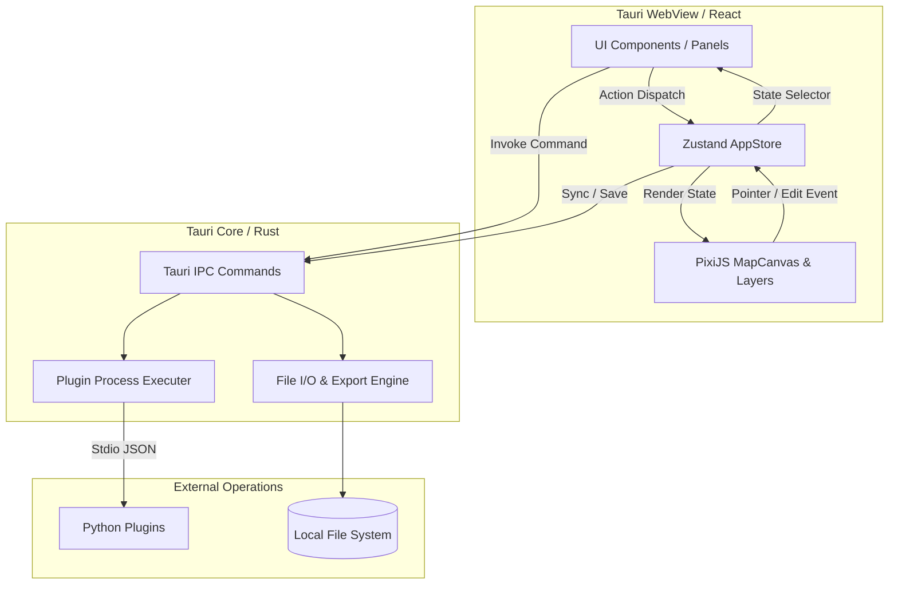

# システムアーキテクチャガイド (Architecture Overview)

本ドキュメントは、ROS Waypoint Tool のシステム構成、ディレクトリ構造、モジュール間相互作用、およびデータフローに関するリファレンスです。

## 1. プロジェクト全体構成 (Directory Structure)

本リポジトリは、TauriWebView (React/TypeScript)、Rust バックエンド、および Python プラグイン SDK から構成されています。

```
waypoint-tool/
├── docs/                      # プロジェクトドキュメント
│   ├── ARCHITECTURE.md        # [本ファイル] アーキテクチャガイド
│   ├── COMPONENT_CATALOG.md   # UI・Canvasコンポーネントカタログ
│   ├── DEVELOPMENT_GUIDE.md   # 開発者ガイド・セットアップ手順
│   ├── RULES.md               # 開発ルール・ショートカット管理
│   ├── REQUIREMENTS.md        # システム要件定義
│   ├── USER_GUIDE.md          # ユーザーガイド
│   └── PLUGIN_GUIDE.md        # プラグイン開発仕様書
├── src/                       # フロントエンド (React + TypeScript)
│   ├── api/                   # バックエンド IPC 通信モジュール
│   ├── components/            # UI および PixiJS Canvas コンポーネント
│   │   ├── canvas/            # PixiJS 描画キャンバスとレイヤー群
│   │   ├── common/            # アプリ共通機能 (ShortcutManager 等)
│   │   └── ui/                # UI コンポーネント (共通要素・各機能パネル)
│   ├── stores/                # Zustand 状態管理 (Slices 構成)
│   ├── types/                 # TypeScript 型定義
│   └── utils/                 # 座標変換・幾何計算などのユーティリティ
├── src-tauri/                 # バックエンド (Rust / Tauri Core)
│   └── src/
│       ├── commands/          # Tauri IPC コマンド群
│       ├── io/                # ファイル読み書き (YAML/JSON エクスポート等)
│       ├── map/               # Map / PGM データ処理
│       ├── models/            # データ構造定義
│       └── plugins/           # 外部プラグイン (Python/WASM) プロセス実行・通信
└── python_sdk/                # プラグイン用 Python SDK & 標準ジェネレータープラグイン
    └── wpt_plugin/            # 幾何計算・通信用 SDK パッケージ
```

---

## 2. システム層と連携モジュール (Data Flow & Architecture)

本アプリケーションは **「UI (React)」「状態 (Zustand)」「描画 (PixiJS)」「バックエンド (Rust)」** の 4 層が疎結合に連携する設計になっています。



### コンポーネント・レイヤー間の役割分担

1. **状態管理の単一真実源 (Zustand AppStore)**:
   - アプリケーション全体の全状態（マップ画像、Waypointデータ、パネル開閉状態、選択要素、Undo/Redo履歴等）を保持します。
   - `src/stores/slices/` にて機能ごとに分割（`mapSlice`, `nodeSlice`, `pluginSlice`, `projectSlice`, `uiSlice`）管理されています。

2. **UI レイヤー (React)**:
   - `appStore` の状態をサブスクライブし、表示およびユーザー入力を受け付けます。
   - キャンバス上の複雑な描画・インタラクションロジックは保持せず、操作結果を `appStore` のアクション呼出に変換します。

3. **描画エンジン (PixiJS Canvas)**:
   - `src/components/canvas/MapCanvas.tsx` をエントリポイントとし、キャンバスビューポートとインフラ描画を提供します。
   - `layers/` 配下の独立した描画レイヤー（`WaypointLayer`, `PathLayer`, `GridLayer`, `PluginLayer` 等）が `appStore` を参照し WebGL メッシュとして描画します。

4. **バックエンド (Tauri / Rust Core)**:
   - ファイルシステムの直接アクセス、Handlebars テンプレートによるエクスポート生成、ROS 形式マップのメタデータ解析を実施します。
   - 外部 Python プラグインプロセスを標準入出力 (`stdin` / `stdout`) で起動・同期通信します。

---

## 3. Zustand 状態管理スライス構造

`src/stores/appStore.ts` は以下のスライスを統合して構築されています。

- **`mapSlice.ts`**: ロード済みマップレイヤー情報、解像度、原点座標、不透明度、アクティブマップ設定。
- **`nodeSlice.ts`**: Waypoint ノードおよびジェネレーターノードの追加・削除・編集・一括操作・Undo/Redo。
- **`pluginSlice.ts`**: 利用可能なプラグイン一覧、アクティブプラグイン設定、実行パラメータ・プレビュー状態。
- **`projectSlice.ts`**: プロジェクトメタデータ、Custom Option Schema、エクスポートテンプレート設定。
- **`uiSlice.ts`**: ツール選択（Move / Add Waypoint 等）、アクティブパネル、モーダル表示状態、ズーム/パン位置。
