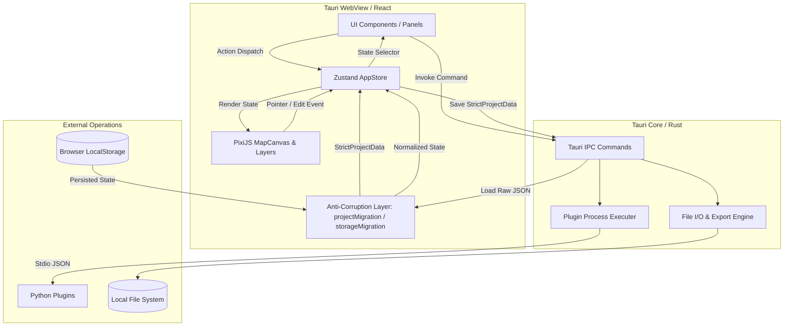
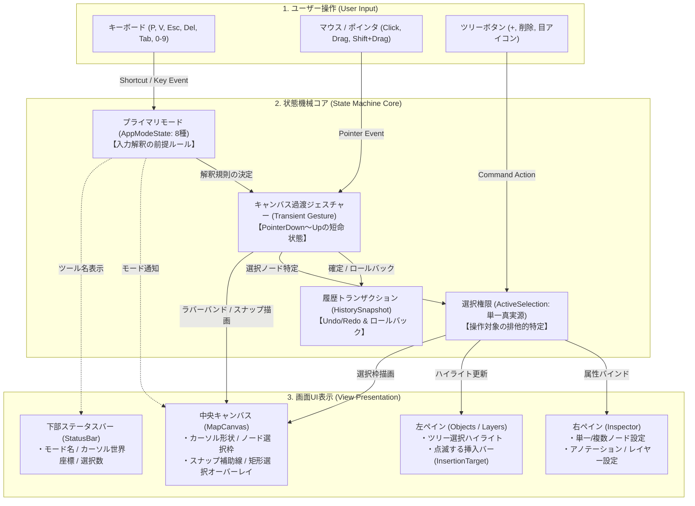
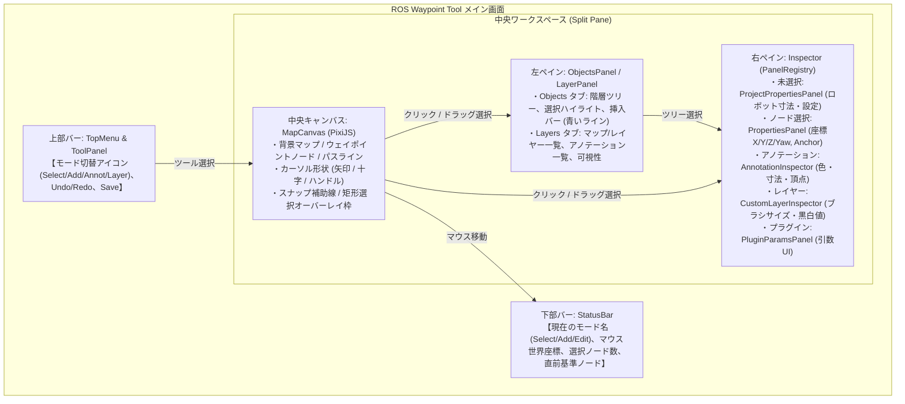

# システムアーキテクチャガイド (Architecture Overview)

本ドキュメントは、ROS Waypoint Tool のシステム構成、ディレクトリ構造、モジュール間相互作用、およびデータフローに関するリファレンスです。

## 1. プロジェクト全体構成 (Directory Structure)

本リポジトリは、TauriWebView (React/TypeScript)、Rust バックエンド、および Python プラグイン SDK から構成されています。

```
waypoint-tool/
├── docs/                      # プロジェクトドキュメント
│   ├── ARCHITECTURE.md        # [本ファイル] アーキテクチャガイド
│   ├── COMPONENT_CATALOG.md   # UI・Canvasコンポーネントカタログ
│   ├── DEVELOPMENT_GUIDE.md   # 開発者ガイド・セットアップ手順
│   ├── RULES.md               # 開発ルール・ショートカット管理
│   ├── STATE_MACHINE.md       # 状態機械・モード遷移・選択権限仕様書
│   ├── REQUIREMENTS.md        # システム要件定義
│   ├── USER_GUIDE.md          # ユーザーガイド
│   └── PLUGIN_GUIDE.md        # プラグイン開発仕様書
├── src/                       # フロントエンド (React + TypeScript)
│   ├── api/                   # バックエンド IPC 通信モジュール
│   ├── components/            # UI および PixiJS Canvas コンポーネント
│   │   ├── canvas/            # PixiJS 描画キャンバスとレイヤー群
│   │   ├── common/            # アプリ共通機能 (ShortcutManager 等)
│   │   └── ui/                # UI コンポーネント (共通要素・各機能パネル)
│   ├── stores/                # Zustand 状態管理 (Slices 構成)
│   ├── types/                 # TypeScript 型定義
│   └── utils/                 # 座標変換・幾何計算などのユーティリティ
├── src-tauri/                 # バックエンド (Rust / Tauri Core)
│   └── src/
│       ├── commands/          # Tauri IPC コマンド群
│       ├── io/                # ファイル読み書き (YAML/JSON エクスポート等)
│       ├── map/               # Map / PGM データ処理
│       ├── models/            # データ構造定義
│       └── plugins/           # 外部プラグイン (Python/WASM) プロセス実行・通信
└── python_sdk/                # プラグイン用 Python SDK & 標準ジェネレータープラグイン
    └── wpt_plugin/            # 幾何計算・通信用 SDK パッケージ
```

---

## 2. システム層と連携モジュール (Data Flow & Architecture)

本アプリケーションは **「UI (React)」「状態 (Zustand)」「描画 (PixiJS)」「バックエンド (Rust)」** の 4 層が疎結合に連携する設計になっています。



### コンポーネント・レイヤー間の役割分担

1. **状態管理の単一真実源 (Zustand AppStore)**:
   - アプリケーション全体の全状態（マップ画像、Waypointデータ、パネル開閉状態、選択要素、Undo/Redo履歴等）を保持します。
   - `src/stores/slices/` にて機能ごとに分割（`mapSlice`, `nodeSlice`, `pluginSlice`, `projectSlice`, `uiSlice` 等）管理されています。

2. **UI レイヤー (React)**:
   - `appStore` の状態をサブスクライブし、表示およびユーザー入力を受け付けます。
   - キャンバス上の複雑な描画・インタラクションロジックは保持せず、操作結果を `appStore` のアクション呼出に変換します。

3. **描画エンジン (PixiJS Canvas)**:
   - `src/components/canvas/MapCanvas.tsx` をエントリポイントとし、キャンバスビューポートとインフラ描画を提供します。
   - `layers/` 配下の独立した描画レイヤー（`WaypointLayer`, `PathLayer`, `FootprintLayer`, `GridLayer`, `PluginLayer` 等）が `appStore` を参照し WebGL メッシュとして描画します。

4. **境界正規化・マイグレーションレイヤー (Anti-Corruption Layer: `src/stores/migrations/`)**:
   - プロジェクトファイル（`.wptroj`）読み込み時の `projectMigration.ts`、およびブラウザローカルストレージ設定（`waypoint-tool-storage`）復元時の `storageMigration.ts` を統括します。
   - 外部入力（旧バージョン形式、未定義プロパティ、キー名揺れ等）をエントリポイント境界で即座に検知し、最新の厳格なスキーマへと完全正規化・デフォルト値補完を実施します。
   - これにより、内部スライスやコンポーネント内に互換フォールバック（`||` や `??`）を散乱させないクリーンアーキテクチャを実現します。

5. **バックエンド (Tauri / Rust Core)**:
   - ファイルシステムの直接アクセス、Handlebars テンプレートによるエクスポート生成、ROS 形式マップのメタデータ解析を実施します。
   - プロジェクトファイルの永続化（`save_project` / `load_project`）は `serde_json::Value` を用いて**完全透過**に扱い、Rust 側での構造体不一致によるデータ消失を防ぎます。
   - 外部 Python プラグインプロセスを標準入出力 (`stdin` / `stdout`) で起動・同期通信します。

---

## 3. Zustand 状態管理スライス構造

`src/stores/appStore.ts` は以下のスライスを統合して構築されています。

- **`mapSlice.ts`**: ロード済みマップレイヤー情報、解像度、原点座標、不透明度、アクティブマップ設定、フットプリント全体表示トグル (`showFootprints`)。
- **`nodeSlice.ts`**: Waypoint ノードおよびジェネレーターノードの追加・削除・編集・一括操作・Undo/Redo。
- **`annotationSlice.ts`**: アノテーションオブジェクト（Point, OrientedPoint, Line, Rect, Circle）およびアノテーショングループ（`AnnotationGroup`）の追加・更新・削除・グループ解除(Explode)・ツリー順序管理・選択・表示トグル・ドラッグ配置モード。
- **`pluginSlice.ts`**: 利用可能なプラグイン一覧、アクティブプラグイン設定、実行パラメータ・プレビュー状態、統合ジェネレーター実行・同期再生成パイプライン (`executeGeneratorPlugin`)。
- **`projectSlice.ts`**: プロジェクトメタデータ、Custom Option Schema、エクスポートテンプレート設定、ロボットフットプリント設定 (`robotFootprint`)、プロジェクト保存・ロード統括（`projectMigration.ts` と連携）。
- **`interactionSlice.ts`**: 状態機械および対話管理（8種の排他ツールモード `AppModeState`、単一真実源の選択モデル `ActiveSelection`、モーダルスタック `modalStack`、階層型エスケープパイプライン、キャンバス過渡ジェスチャーのアボート登録機構）。
- **`uiSlice.ts`**: ツール選択（Move / Add Waypoint 等）、アクティブパネル、モーダル表示状態、ズーム/パン位置。
- **`historySlice.ts`**: 履歴スタック管理（Undo / Redo、トランザクション、`pushHistorySnapshot` による原子的履歴記録）。
- **`workflowSlice.ts`**: ワークフローステップ管理（動的UIでのステップ進行、ステップ実行状態・変数の追跡）。
- **`customUiSlice.ts`**: 動的UI定義（プリセット検出、カスタムUI設定ロード、レイアウトオーバーライド）。

---

## 4. カスタムレイヤー vs アノテーションの概念と役割分担 (Raster vs Vector)

本アプリケーションでは、矩形・円形・直線（Line）などの幾何図形を配置できる2つの機能（カスタムレイヤーとアノテーション）が存在します。幾何学的データ構造や操作性（リサイズ・回転・端点操作ハンドル）は共通化されていますが、その用途と出力形式が異なります。

| 概念 | アノテーション (Annotation) | カスタムレイヤー (CustomLayer) |
|---|---|---|
| **基本設計** | **ベクターメタデータ (Vector ROI / Metadata)** | **ラスターマップ合成 (Raster Occupancy Grid)** |
| **主な用途** | ナビゲーション関心領域、仮想壁・進入禁止ライン、プラグイン幾何入力 | マップ上の障害物追加/消去、壁・実寸線などのピクセル書き込み |
| **主な属性** | `name`, `color`, `visible`, `group_id` | `fillValue` (0:黒/障害物, 255:白/自由空間), `opacity`, `blend_mode` |
| **出力結果** | ベクターデータ (JSON / YAML / メタデータ) | ラスター画像 (PGM / PNG / Base64 Occupancy Grid) |
| **Lineの役割** | 仮想壁、境界線、進入禁止ラインなどの幾何データ | マップ画像上に引く実寸幅の障害物壁・白線などのピクセル描画 |

---

## 5. システム不変条件 (System Invariants)

システム全体の整合性と拡張性を維持するため、以下の不変条件がアーキテクチャ全体に義務付けられています。

### 5.1 コンテナ受入不変条件 (Container Acceptance Invariant)
- ツリー構造において、子ノード（`children_ids`）を保持できるのは `manual_group` および `group` のみとする。
- `generator`（外部プラグインによる自動生成管理）および `manual`（単一の葉ノード）に対する子ノードの挿入・ドラッグ＆ドロップ投入は、ドメイン境界（Store アクション `moveNodesInTree`, `addNodes` 等）で厳格に遮断・拒絶（Reject）する。
- 自動生成ノードを手動編集したい場合は、明示的な「グループ展開（Explode / `ungroupNode`）」アクションを通じて `manual_group` へ変換することを必須とする。

### 5.2 経路走査の正準 DFS 規約 (Canonical Traversal Standard)
- ウェイポイントの走査順序（番号順）を扱うすべての機能（`PathLayer`, `PathRouter`, `ExportModal`, 経路長計算等）は、独自走査ループの実装を禁止し、共通関数 `getFlattenedWaypointIds`（`src/utils/treeUtils.ts`）による深さ優先探索（DFS）を単一の真実（Single Source of Truth）とする。

### 5.3 マップ原点の 2D 剛体変換規約 (Rigid 2D Map Origin Transform)
- ROS のマップ原点 `origin: [x, y, yaw]` に対し、世界座標 $(x_w, y_w)$ とピクセル座標 $(c, r)$ の相互変換は、必ず $Yaw$ 回転行列 $R(\theta)$ を含む 2D 剛体変換式を一貫適用する。
- フロントエンドの描画・ラスタライズと、Rust バックエンド（`blending.rs` 等）の双方でこの数学的変換式を統一する。

### 5.4 ツリー変形時の挿入境界射影規約 (Adjacent Boundary Projection Standard)
- ツリー変形（ノード削除、Group作成・解除、ノード移動、複製等）を行うすべての Store アクションは、直前ノードに基づく共通写像関数 `mapInsertionTarget`（`src/utils/treeUtils.ts`）を介して `insertionTarget` を安全に追従・更新しなければならない。
- 複数ノードの追加はループによる個別 `addNode` 呼び出しを禁止し、単一トランザクション・単一履歴スナップショットで完結する `addNodes` 一括登録 API を使用すること。

---

## 6. 状態遷移および対話アーキテクチャ (State Machine & Interaction Architecture)

複雑なツールモードや過渡操作の競合を防ぐため、本アプリケーションは状態機械（State Machine）を中心に設計されています。
ユーザー操作（Action）、状態機械コア（State）、および画面UI表示（View）が3層で協調し、Single Source of Truth に基づく決定論的な振る舞いを保証します。

詳細な設計仕様、直交5軸の定義、ウェイポイント操作モデル、UI表示マトリクス、完全な状態遷移マトリクス、Mermaid状態遷移図、および不変条件カタログについては、公式仕様書 📖 **[docs/STATE_MACHINE.md](./STATE_MACHINE.md)** を参照してください。

### 6.1 「状態（State）× 操作（Action）× UI表示（View）」の3層協調アーキテクチャ



### 6.2 画面レイアウトと各UI領域の表示責務マップ (UI Presentation Layout)



### 6.3 コアコンセプトの要約
1. **5つの直交状態軸**:
   - `Modal Stack`（最上位モーダル）
   - `DOM Text Focus`（文字入力専有）
   - `Primary Tool Mode`（8種の完全排他モード `AppModeState`）
   - `Canvas Transient Gestures`（短命ドラッグ・描画操作）
   - `Selection Authority`（単一真実源 `ActiveSelection`）
2. **4フェーズ同期ライフサイクルパイプライン**:
   - `transitionToMode` 単一チョークポイントにおいて、`Phase 1: Guard` → `Phase 2: OnExit（過渡アボート強制ロールバック・同期リスナー通知）` → `Phase 3: State Mutation（状態更新・非互換選択クリア）` → `Phase 4: OnEnter（新モード初期化・同期リスナー通知）` を決定論的に実行。
3. **委譲型過渡アボートとポインタ喪失保護 (Inversion of Control)**:
   - ストアはキャンバスの具体実装を知らず、`registerCanvasAbortHandler` 経由で登録された破棄関数を呼ぶのみの疎結合構造。
   - キャンバスは `pointercancel`, `lostpointercapture`, `window.blur` を監視し、OS/ブラウザレベルでのポインタ喪失時にも即座に安全なロールバックを実行。
4. **階層型エスケープ・パイプライン**:
   - `Tier 1（最前面モーダル）` → `Tier 2（入力フォーカス）` → `Tier 3（過渡ジェスチャーロールバック）` → `Tier 4（スナップ精密入力クリア）` → `Tier 5（選択解除）` → `Tier 6（モード復帰）` → `Tier 7（アイドル）` の順序律で段階的にキャンセルを実行。
5. **決定論的 Inspector 解決**:
   - モードと `ActiveSelection` に基づき、右ペインに表示すべき Inspector を一意かつ決定論的にルーティング（純粋関数解決）。
