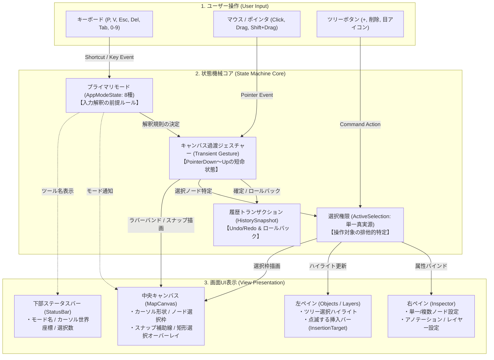
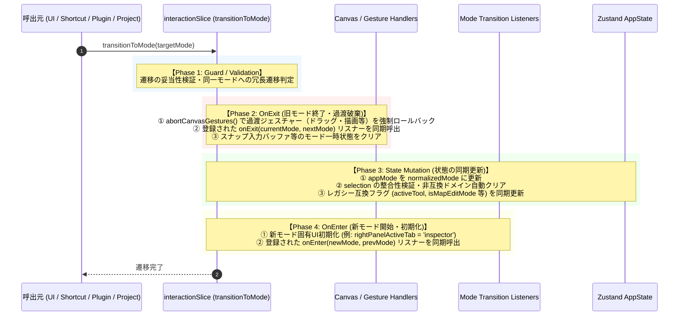
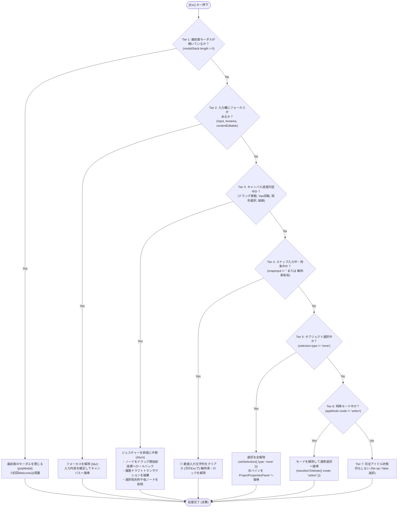
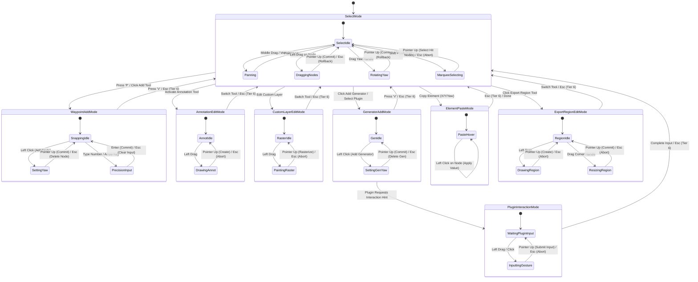
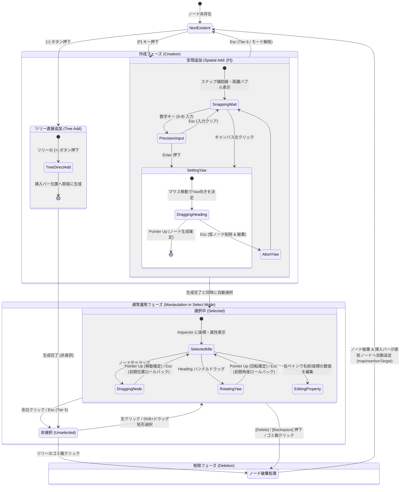
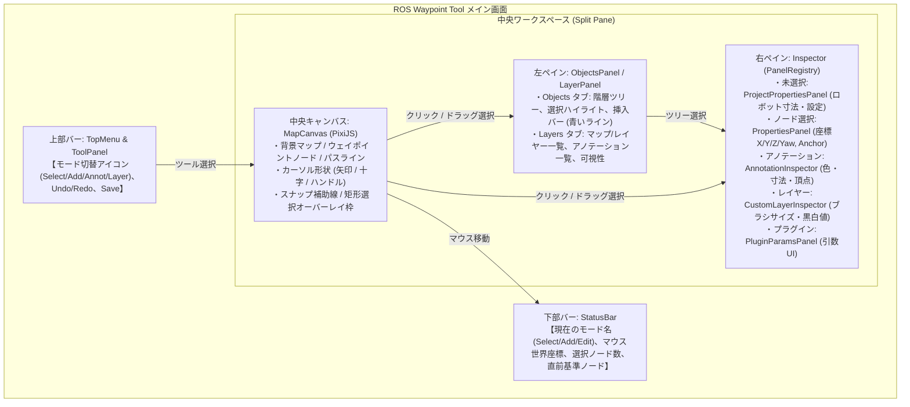
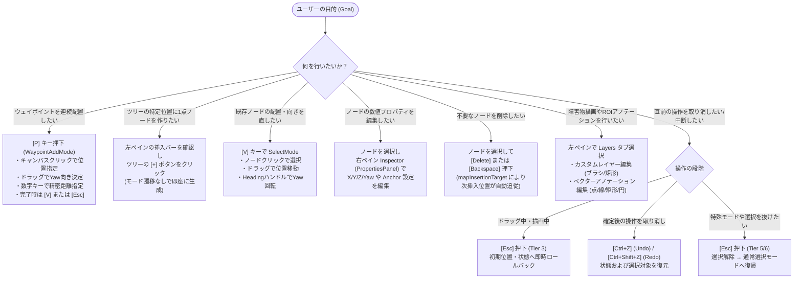

# 状態機械および対話アーキテクチャ仕様書 (State Machine & Interaction Architecture)

本ドキュメントは、ROS Waypoint Tool における状態管理、モード遷移、ポインタ過渡対話（Transient Gestures）、単一真実源の選択権限モデル、階層型エスケープ・パイプライン、およびUI画面表示の連動に関する包括的なアーキテクチャ仕様書です。

今後新しいツールモード、編集機能、選択対象、UIパネル、またはショートカットを追加する開発者は、本仕様書に定義された原則と不変条件を必ず遵守してください。

---

## 1. 概要と設計思想 (Overview & Philosophy)

GUI/CAD/ベクター編集ツールにおいては、オブジェクト選択、ウェイポイント配置、アノテーション描画、ラスターマップ編集、プラグイン対話など、多種多様な操作モードが存在します。これらを単純な独立フラグ（`isEditing`, `isAdding`, `isMapEdit` 等）の組み合わせで管理すると、**状態の組み合わせ爆発（State Combinatorial Explosion）**が発生し、以下のような深刻な不具合を引き起こします：

1. **モードの多重起動と衝突**: アノテーション描画中にウェイポイント配置キーが発火し、意図しないデータが作成される。
2. **選択権限の散乱**: ウェイポイントとアノテーションが同時に選択状態になり、右ペインの Inspector がどちらを表示・更新すべきか判定不能になる。
3. **過渡対話の中断失敗**: ノードをドラッグ中に Escape を押しても初期位置に戻らず中途半端な座標で確定してしまう、あるいはドラッグ中にモーダルが開いてキャンバス操作がスタックする。
4. **不自然な Escape 挙動**: テキスト入力中に Escape を押すと作業中のモード全体が強制終了してしまう。

本アーキテクチャでは、**第一原理（First Principles）**に基づき、状態空間を **5つの直交する独立次元（Orthogonal Axes）** に分解し、各次元の不変条件（Invariants）を数学的・型安全に定義することで、上記の問題を原理的に排除しています。

---

## 2. 状態・操作・UI表示の3層協調と5つの直交状態次元

### 2.1 「状態（State）× 操作（Action）× UI表示（View）」の3層協調アーキテクチャ

ユーザーの物理的操作（マウス・キーボード・ツリー操作）がどのように解釈され、状態機械の各次元を遷移させ、画面の各UIコンポーネント（Canvas, Inspector, Tree, StatusBar）へフィードバックされるかの全体アーキテクチャです。



1. **ユーザー操作層 (Action / User Input)**: キーボード・マウス・ボタン等の物理イベントを受け付けます。
2. **状態機械コア (State Machine Core)**: 入力を解釈し、5つの直交次元および履歴トランザクションを矛盾なく更新します。
3. **画面UI表示層 (View Presentation)**: 状態機械の最新値のみを参照（Single Source of Truth）し、キャンバス、ツリー、インスペクタ、ステータスバーへ決定論的に描画します。

---

### 2.2 5つの直交状態次元 (The 5 Orthogonal State Axes)

アプリケーションの状態は、互いに干渉しない5つの独立した次元の直積集合としてモデル化されます。

```
┌─────────────────────────────────────────────────────────────────────────────┐
│                       5つの直交状態次元 (Orthogonal Axes)                      │
├─────────────────────────────────────────────────────────────────────────────┤
│  [Axis 1: Modal Stack]        Normal (Empty) ──[Open]──> ModalActive (Stack)│
│                               (最上位オーバーレイ / LIFOスタック)              │
│                                                                             │
│  [Axis 2: DOM Text Focus]     Unfocused ──[Click Input]──> InlineEditing    │
│                               (入力要素へのDOMフォーカス / キー専有)           │
│                                                                             │
│  [Axis 3: Primary Tool Mode]  Select | WaypointAdd | GeneratorAdd | ...     │
│                               (8つの排他的な第一級ツールモード: AppModeState)    │
│                                                                             │
│  [Axis 4: Transient Gesture]  Idle | Panning | Dragging | Rotating | ...    │
│                               (PointerDown〜Up/Abort の物理的短命状態)        │
│                                                                             │
│  [Axis 5: Selection Authority] None | Nodes | Annotations | CustomLayer     │
│                               (単一権限の排他コンテナ: ActiveSelection)       │
└─────────────────────────────────────────────────────────────────────────────┘
```

#### Axis 1: モーダルスタック (Modal Stack)
- **管理スライス**: `interactionSlice.ts` (`modalStack: ModalType[]`)
- **状態定義**: 空配列 `[]`（モーダルなし）または `[ModalType, ...]`（開いているモーダルの LIFO スタック）。
- **対象モーダル**: `'settings' | 'export' | 'import' | 'export_maps' | 'shortcuts' | 'welcome' | 'plugin_data'`
- **性質**: 最上位のグローバルオーバーレイです。モーダルが開いている間は、キャンバスのポインタ操作やグローバルショートカットはすべて遮断されます。
- **例外規則**: 初回起動時の `welcome` モーダル（`isInitialLaunch: true`）は、プロジェクト作成またはマップ読み込みが完了するまで Escape による破棄が禁止されます。

#### Axis 2: DOM テキストフォーカス (DOM Text Focus)
- **状態定義**: `Unfocused` または `<input>` / `<textarea>` / `<select>` / `contentEditable` 要素へのフォーカス中。
- **性質**: ユーザーが文字列や数値を入力している過渡状態です。すべての文字・数字キー、Backspace、Delete、矢印キー等はDOM要素にローカルに専有され、キャンバスのツール切替ショートカット等は完全に遮断されます。
- **脱出規則**: Escape キー押下により `document.activeElement.blur()` が実行され、入力フォーカスのみが解除されます。

#### Axis 3: プライマリ対話モード (Primary Tool Mode: 完全排他)
- **管理スライス**: `interactionSlice.ts` (`appMode: AppModeState`)
- **性質**: アプリケーションの「現在の主たる操作意図」を決定する**8つの排他的な第一級状態**です。Discriminated Union（判別共用体）として定義され、複数のモードが同時に存在することは型レベルおよびランタイムで不可能です。

#### Axis 4: キャンバス過渡ジェスチャー (Canvas Transient Gestures: 短命状態)
- **管理コンポーネント**: `src/components/canvas/MapCanvas.tsx`
- **性質**: 各プライマリモード配下で、ポインタ（マウス/タッチ）が押下されてから離される（または中断される）までの物理的な過渡操作です。
- **状態一覧**:
  - `idle`: ポインタ未押下
  - `pan_map`: 中ドラッグまたは余白左ドラッグによる視点移動
  - `drag_node`: ノードのドラッグ移動（初期座標保持・ロールバック可能）
  - `set_yaw`: ノードの向き角調整ドラッグ
  - `marquee_select`: Shift+ドラッグによる矩形範囲選択（AABB包含ノードの一括選択）
  - `draw_shape`: アノテーションまたはマップ編集の図形ラバーバンド描画
  - `transform_shape`: 図形やROIのハンドルドラッグ変形
  - `precision_snapping`: スナップ拘束・数値キー入力中
- **アボート機構**: `registerCanvasAbortHandler` によりハンドラが登録され、Escape 押下時にドラッグ前座標へのロールバックと履歴破棄を原子的（Atomic）に実行します。

#### Axis 5: 選択ドメイン単一権限 (Selection Authority: 排他的単一真実源)
- **管理スライス**: `interactionSlice.ts` (`selection: ActiveSelection`)
- **性質**: 右ペインの Inspector 表示および一括編集の対象となる単一の権限コンテナです。ノード、アノテーション、カスタムレイヤーのいずれか1種類のみが権限を保持でき、多重選択は排他的に排除されます。

---

## 3. 8つのプライマリ対話モード仕様 (8 Primary Tool Modes)

`src/types/mode.ts` にて定義される `AppModeState` は以下の8つのバリアントを持ちます。

```typescript
export type AppModeState =
  | { mode: 'select' }
  | {
      mode: 'waypoint_add';
      snapInput: string;
      lockedWaypointId: string | null;
      forcedAxis: 'X' | 'Y' | null;
      forcedSign: 1 | -1 | null;
    }
  | {
      mode: 'generator_add';
      pluginId: string | null;
    }
  | {
      mode: 'annotation_edit';
      subTool: AnnotationToolType;
      targetGroupId: string | null;
    }
  | {
      mode: 'custom_layer_edit';
      subTool: 'rect' | 'circle' | 'freehand' | 'line';
      targetLayerId: string;
      fillValue: number;
      brushSize: number;
    }
  | { mode: 'export_region_edit' }
  | {
      mode: 'plugin_interaction';
      pluginId: string;
      inputKey: string;
    }
  | {
      mode: 'element_paste';
      field: ElementCopyField;
      value: number;
      coordSystem: ElementCopyCoordSystem;
      previewNodeId: string | null;
    }
  | { mode: 'measure' };
```

### 3.1 各モードの詳細仕様

| モード名 (`mode`) | ペイロード | トリガー操作 | キャンバス挙動 | 右ペイン Inspector | 脱出契機 |
|---|---|---|---|---|---|
| **`select`** | なし | `V` キー / 選択ツールクリック / 他モード完了 | クリックで要素選択、ドラッグで移動、Shift+ドラッグで矩形範囲選択 | 選択ドメイン（`ActiveSelection`）に応じた Inspector | -（ベース状態） |
| **`waypoint_add`** | `snapInput`: 精密入力文字列<br>`lockedWaypointId`: スナップ対象ID<br>`forcedAxis`: 拘束軸<br>`forcedSign`: 拘束方向 | `P` キー / ウェイポイント追加ツールクリック | クリックでノード配置、ドラッグでYaw角調整、数字キーで精密距離入力 | 配置中ノードの設定 / 直前選択 | `V` キー / 配置完了 / Esc (Tier 6) |
| **`generator_add`** | `pluginId`: 配置するジェネレータID | ジェネレータ追加ツール / プラグイン一覧の配置クリック | クリックで生成起点ノード配置、ドラッグでYaw角調整 | ジェネレータパラメータパネル (`inspector` タブ強制) | `V` キー / 配置完了 / Esc (Tier 6) |
| **`annotation_edit`** | `subTool`: `point` \| `oriented_point` \| `line` \| `rect` \| `circle` \| `select`<br>`targetGroupId`: 所属グループID | アノテーションタブで編集開始 / サブツール選択 | ドラッグでベクターROI図形ラバーバンド描画、頂点ドラッグ変形 | アノテーション Inspector (`inspector` タブ強制) | 完了ボタン / 他ツール切替 / Esc (Tier 6) |
| **`custom_layer_edit`**| `subTool`: `rect` \| `circle` \| `freehand` \| `line`<br>`targetLayerId`: 編集対象レイヤーID<br>`fillValue`: 占有値 (0〜255)<br>`brushSize`: ブラシ半径 | カスタムレイヤー編集開始 / サブツール選択 | ドラッグでラスターピクセル描画・図形ラスタライズ | カスタムレイヤー Inspector (`inspector` タブ強制) | 完了ボタン / 他ツール切替 / Esc (Tier 6) |
| **`export_region_edit`**| なし | エクスポート矩形ツールクリック | ドラッグでエクスポート矩形領域の作成、バウンディングボックス変形 | エクスポート設定 Inspector | 完了 / 他ツール切替 / Esc (Tier 6) |
| **`plugin_interaction`**| `pluginId`: 要求プラグインID<br>`inputKey`: 対話パラメータキー名 | 外部Pythonプラグインが `interaction_hint` を要求 | ヒントに応じたポインタ座標／方向／図形入力待ち | プラグイン対話入力パネル | 入力確定 / プラグイン中断 / Esc (Tier 6) |
| **`element_paste`** | `field`: コピー対象 (`x`\|`y`\|`z`\|`yaw`)<br>`value`: コピー値<br>`coordSystem`: 座標系<br>`previewNodeId`: ホバー中ノードID | Inspector で要素コピーボタン押下 | ノードホバーで適用プレビュー表示、クリックで個別適用 | 貼り付け対象ノードの Inspector | 完了 / クリア操作 / Esc (Tier 6) |
| **`measure`** | なし | `M` キー / TOOLS メジャーアイコンクリック | 2点クリックまたは2オブジェクトクリックで実寸距離[m]を計測、リアルタイム距離バッジ描画、アノテーション保存フラグ | 現在の選択に応じた表示 / 上部バナー | `V` キー / 完了 / Esc (Tier 6) |

### 3.2 モード遷移の 4フェーズ同期ライフサイクルパイプライン

すべてのモード変更は、単一のチョークポイント `useAppStore.getState().transitionToMode(transition)` を通過し、以下の4フェーズを決定論的順序で実行します：



### 3.3 同期ライフサイクル購読機構 (`subscribeModeTransition`)

React の `useEffect` はブラウザ描画後の非同期実行であるため、モード切替瞬間の同期的クリーンアップには不適です。
描画エンジン（PixiJS）や特定コンポーネントがモード遷移を同期的かつ決定論的に捕捉できるよう、`interactionSlice` は `subscribeModeTransition` を提供します：

```typescript
const unsubscribe = useAppStore.getState().subscribeModeTransition({
  onExit: (currentMode, targetMode) => {
    // 旧モードの即時リソース解放・クリーンアップ
  },
  onEnter: (newMode, previousMode) => {
    // 新モードの即時セットアップ
  },
});
```

---

## 4. 選択権限モデルと Inspector 決定論的解決 (Selection Model)

### 4.1 `ActiveSelection` による排他的単一真実源

右ペインの Inspector やキャンバス上の選択ハイライトは、`interactionSlice.ts` の `selection: ActiveSelection` を単一の真実源とします。

```typescript
export type ActiveSelection =
  | { type: 'none' }
  | { type: 'nodes'; ids: string[] }
  | { type: 'annotations'; ids: string[] }
  | { type: 'custom_layer'; layerId: string; selectedObjectId: string | null };
```

- **相互排他律**: `nodes` を選択した瞬間に `selectedAnnotationIds` や `activeCustomLayerId` は自動的にクリアされます。同様に、`annotations` を選択した瞬間は `selectedNodeIds` が空配列になります。
- **履歴（Undo / Redo）の統合**: `pushHistorySnapshot()` は `selection` の状態をスナップショットに保存します。Undo または Redo を実行すると、変更されたオブジェクトだけでなく**その瞬間の選択状態（`selection`）も原子的かつ完全に復元**されます。

### 4.2 Inspector の決定論的ルーティング (Deterministic Inspector Resolution)

右ペインの Inspector は、優先順位に基づいて決定論的に描画コンポーネントを決定します。

```mermaid
graph TD
    Start[Inspector 描画要求] --> CheckMode{プライマリモードが<br>特定Inspectorを要求するか?}
    CheckMode -->|generator_add / plugin_interaction| PluginInspector[プラグイン・ジェネレータ設定パネル]
    CheckMode -->|custom_layer_edit| LayerEditInspector[カスタムレイヤー描画プロパティ]
    CheckMode -->|annotation_edit| AnnotEditInspector[アノテーション編集プロパティ]
    CheckMode -->|いいえ (select / waypoint_add)| CheckSelection{ActiveSelection.type}

    CheckSelection -->|custom_layer| LayerInspector[カスタムレイヤー Inspector]
    CheckSelection -->|annotations| AnnotInspector[アノテーション Inspector]
    CheckSelection -->|nodes (単一または複数)| NodeInspector[ウェイポイント / グループノード Inspector]
    CheckSelection -->|none| ProjectInspector[プロジェクト設定 / 未選択表示]
```

この決定論的パイプラインにより、複数の要素が同時に Inspector の表示権を奪い合う競合（Race Condition）を完全に排除しています。

---

## 5. 階層型エスケープ・パイプライン (Tier 1〜Tier 7 Cancellation Ladder)

Escape キーが押下された際、単一のグローバルディスパッチャ `handleGlobalEscape()` が実行されます。
このパイプラインは、**「局所性（Locality）が最も高い（破壊的影響が最小で、可逆性の高い）状態から順に取り消す」** という数学的順序律に従います。

$$\text{Tier 1} \to \text{Tier 2} \to \text{Tier 3} \to \text{Tier 4} \to \text{Tier 5} \to \text{Tier 6} \to \text{Tier 7}$$

### 5.1 階層型エスケープ決定フローチャート (Mermaid)



### 5.2 各 Tier の詳細仕様と責任範囲

1. **Tier 1: 最前面モーダル（Modal Stack Top）**
   - 判定: `modalStack.length > 0` または各モーダルの開閉フラグが true。
   - 動作: 最前面のモーダル1つのみをスタックからポップ（`popModal()`）して閉じます。
   - 例外: 初回起動時の Welcome モーダル（`isInitialLaunch: true`）は Escape では閉じず、処理を終了（`return true`）します。
2. **Tier 2: DOM テキストフォーカス（DOM Text Editing Focus）**
   - 判定: `document.activeElement` が `<input>`, `<textarea>`, `<select>`, または `isContentEditable`。
   - 動作: `activeElement.blur()` を実行してテキスト編集モードを抜け、キャンバスへ操作権を戻します。入力中の値は確定（Commit）されます。
3. **Tier 3: キャンバス過渡ジェスチャー（Canvas Transient Gestures Abort）**
   - 判定: `registerCanvasAbortHandler` で登録された過渡ハンドラがアクティブ（ドラッグ中、回転中、矩形選択中、図形描画中など）。
   - 動作: 最新のハンドラから逆順（LIFO）で呼出し。ノード移動であればドラッグ開始時の初期座標（`initialTransforms`）へロールバックし、作成途中の履歴ドラフトスナップショットを破棄します。
4. **Tier 4: スナップ・精密数値入力拘束（Snapping & Precision Input Constraints）**
   - 判定: `appMode.mode === 'waypoint_add'` において、精密距離入力文字列 `snapInput` が存在するか、または軸拘束（`forcedAxis` / `forcedSign` / `lockedWaypointId`）が有効。
   - 動作: `snapInput` があればまず数値をクリア（`''`）します。数値が空で拘束があれば拘束を解除します。2段階で段階的にクリアされます。
5. **Tier 5: オブジェクト選択解除（Mutually Exclusive Selection Clear）**
   - 判定: `selection.type !== 'none'`。
   - 動作: `setSelection({ type: 'none' })` を呼び出し、ノードやアノテーションの選択を全解除します。
6. **Tier 6: 特殊対話モードからの脱出（Mode Exit to Select）**
   - 判定: `appMode.mode !== 'select'`。
   - 動作: `transitionToMode({ mode: 'select' })` を呼び出し、安全にデフォルトの選択ツールモードへ復帰します。
7. **Tier 7: 完全アイドル（Idle No-op）**
   - 判定: 上記の全条件に該当しない（モーダルなし、フォーカスなし、ジェスチャーなし、数値入力なし、選択なし、すでに `select` モード）。
   - 動作: 何もしません（`return false`）。OSやブラウザのデフォルト挙動を妨げません。

---

## 6. 状態遷移図とマトリクス (State Transition Diagram & Matrix)

### 6.1 8大プライマリ対話モードの遷移と相互関係図 (Primary Tool Modes)

アプリケーションに存在する8つの排他的な第一級ツールモードと、その切り替えトリガー・脱出条件です。

```mermaid
stateDiagram-v2
    [*] --> SelectMode : アプリ起動

    note right of SelectMode
        デフォルト状態
        ・ノード選択 / 一括ドラッグ移動
        ・Shift+ドラッグ矩形選択 (Marquee)
        ・余白ドラッグでマップスクロール (Pan)
    end note

    note right of WaypointAddMode
        [P] ウェイポイント連続配置
        ・直前ノードからの自動スナップ
        ・精密距離数値入力 (0-9)
    end note

    note right of GeneratorAddMode
        プラグインによる生成ノード配置
        ・パラメータ設定パネル表示
    end note

    note right of AnnotationEditMode
        ベクターアノテーション編集
        ・点 / 線 / 矩形 / 円の描画・変形
    end note

    note right of CustomLayerEditMode
        マップ占有グリッドのラスタ編集
        ・矩形 / 円 / 線 / フリーハンド描画
    end note

    note right of ExportRegionEditMode
        エクスポート矩形領域の編集
        ・バウンディングボックスの四隅変形
    end note

    note right of PluginInteractionMode
        プラグインが要求する対話パラメータ配置
        ・点列や特定矩形の指定
    end note

    note right of ElementPasteMode
        座標要素 (X/Y/Yaw) の個別貼り付け待機
    end note

    SelectMode --> WaypointAddMode : [P] キー / ツールバー [+] アイコン
    WaypointAddMode --> SelectMode : [V] キー / Esc (Tier 6)

    SelectMode --> GeneratorAddMode : プラグインリストから起動
    GeneratorAddMode --> SelectMode : [V] キー / Esc (Tier 6) / 配置完了

    SelectMode --> AnnotationEditMode : アノテーションツール選択
    AnnotationEditMode --> SelectMode : 完了ボタン / [V] キー / Esc (Tier 6)

    SelectMode --> CustomLayerEditMode : カスタムレイヤー編集開始
    CustomLayerEditMode --> SelectMode : 完了ボタン / [V] キー / Esc (Tier 6)

    SelectMode --> ExportRegionEditMode : エクスポート領域ツール選択
    ExportRegionEditMode --> SelectMode : [V] キー / Esc (Tier 6)

    GeneratorAddMode --> PluginInteractionMode : 対話ヒント要求
    PluginInteractionMode --> SelectMode : 入力完了 / Esc (Tier 6)

    SelectMode --> ElementPasteMode : 右クリックメニュー「要素をコピー」
    ElementPasteMode --> SelectMode : 貼り付け完了 / Esc (Tier 6)
```

### 6.2 詳細過渡対話ステートチャート (Detailed Transient Gestures)

各モード内部における、ポインタのドラッグやジェスチャーによる短命な過渡状態の遷移です。



### 6.3 状態遷移マトリクス (State Transition Matrix)

| 現在のモード (`appMode`) | トリガーイベント | 遷移先モード (`appMode`) | 副次アクション・副作用 |
|---|---|---|---|
| 任意 | モーダルオープン (`pushModal`) | （モード維持） | 最前面モーダル表示、ショートカット・キャンバス対話遮断 |
| 任意 | 入力欄クリック | （モード維持） | DOM フォーカス、キー入力をローカル専有 |
| **`select`** | `P` キー押下 | **`waypoint_add`** | スナップ拘束を初期化、`activeTool = 'add_point'` |
| **`select`** | プラグイン配置要求 | **`generator_add`** | `activePluginId` 設定、Inspector タブへ切替 |
| **`select`** | アノテーションツール選択 | **`annotation_edit`** | `subTool` 設定、アノテーション Inspector へ切替 |
| **`select`** | カスタムレイヤー編集要求 | **`custom_layer_edit`**| レイヤーID設定、`isMapEditMode = true` |
| **`select`** | エクスポート矩形ツール選択 | **`export_region_edit`**| `activeTool = 'add_export_region'` |
| **`select`** / **`generator_add`** | プラグイン対話ヒント要求 | **`plugin_interaction`**| `pluginId` / `inputKey` 設定、対話パネル表示 |
| **`select`** | 要素コピー（X/Y/Yaw等） | **`element_paste`** | `elementCopyState` 格納、貼り付け待機 |
| **`waypoint_add`** | `V` キー押下 / 配置完了 | **`select`** | `activeTool = 'select'`、スナップ入力破棄 |
| **`generator_add`** | 配置完了 / `V` キー押下 | **`select`** | `activeTool = 'select'`、配置ノードを選択状態に設定 |
| **`annotation_edit`** | 完了ボタン / ツール切替 (`V` 等) | **`select`** | `isAnnotationEditMode = false`、アノテーション選択維持 |
| **`custom_layer_edit`**| 完了ボタン / ツール切替 (`V` 等) | **`select`** | `isMapEditMode = false`、ラスター画像確定 |
| **`export_region_edit`**| 完了 / ツール切替 (`V` 等) | **`select`** | `activeTool = 'select'`、矩形領域確定 |
| **`plugin_interaction`**| 入力確定 / プラグイン中断 | **`select`** | 対話データ送信、`activePluginId = null` |
| **`element_paste`** | 完了 / クリア操作 | **`select`** | `elementCopyState = null` |
| 非 `select` モード | Escape (Tier 6 到達時) | **`select`** | モードを `select` に復帰、過渡状態破棄 |

---

## 7. システム不変条件カタログ (System Invariants Catalog)

システム全体の整合性・信頼性を保つため、以下の5大不変条件がアーキテクチャ全体に義務付けられています。

### 7.1 モード完全排他不変条件 (Mode Mutual Exclusivity Invariant)
- **定義**: いかなる瞬間においても、`AppModeState` に定義された8つのプライマリモードのうち2つ以上が同時にアクティブになってはならない。
- **強制手法**: Discriminated Union 型による型レベル保証、および `transitionToMode` による原子的切替。旧ブール値フラグ（`isMapEditMode`, `isAnnotationEditMode` 等）を直接変更してモードを並立させることは禁止。

### 7.2 選択単一真実源不変条件 (Selection Single Authority Invariant)
- **定義**: 右ペインの Inspector 表示権および主たる選択対象（`selection: ActiveSelection`）は、ノード、アノテーション、カスタムレイヤーのうち常に1つのドメインのみに属さなければならない。
- **強制手法**: `setSelection` 呼出による他ドメイン選択IDの自動クリア。複数ドメインのオブジェクトを同時に選択状態にすることはアーキテクチャ違反。

### 7.3 過渡ジェスチャーの原子的ロールバックとポインタ喪失保護不変条件 (Gesture Atomicity & Pointer Loss Protection Invariant)
- **定義**: ポインタ押下から離脱までの物理的ジェスチャー（ドラッグ、回転、描画等）は、離脱（PointerUp）の瞬間まで未確定（Uncommitted）とし、中断（Escape等）やポインタ喪失（`pointercancel`, `lostpointercapture`, ウィンドウフォーカス喪失 `blur`）が発生した場合は必ず操作直前の初期状態（`initialTransforms`）へ完全ロールバックしなければならない。
- **強制手法**: `registerCanvasAbortHandler` へのアボート処理登録義務、キャンバスコンテナにおける `pointercancel` / `lostpointercapture` / `window.blur` リスナーの常時監視、および中断時の履歴ドラフト破棄。

### 7.4 単一トランジションチョークポイント不変条件 (Unified Transition Choke Point Invariant)
- **定義**: ショートカット、ツールバー、メニュー、プラグイン対話、Escapeキー、Undo/Redo、プロジェクト読込・リセットを含むすべての状態・モード変更要求は、例外なく単一のチョークポイント（`transitionToMode` または `abortCanvasGestures`）を通過しなければならない。
- **強制手法**: `transitionToMode` の OnExit フェーズにおける過渡ジェスチャー自動アボート、`projectSlice` および `historySlice` での `abortCanvasGestures` 同期実行、直接の `set({ appMode: ... })` 代入の禁止。

### 7.5 エスケープ局所性順序不変条件 (Escape Locality Ladder Invariant)
- **定義**: Escape キー入力は、常に「局所性が高く、可逆的で、破壊的影響が最小の状態」から段階的に取り消されなければならず、上位スコープ（モードやプロジェクト）を誤って巻き込んではならない。
- **強制手法**: 単一の `handleGlobalEscape()` ディスパッチャによる厳格な Tier 1〜Tier 7 評価順序。各コンポーネントが勝手に Escape イベントを `stopPropagation()` してパイプラインを破壊することを禁止。

---

## 8. ウェイポイント操作の体系的整理 (Waypoint Manipulation Model)

ウェイポイントの生成・選択・編集・削除は、CADツールにおける「空間的直感操作」と「構造的・決定論的コマンド」の調和に基づいて設計されています。

### 8.1 モード依存の空間対話 vs 普遍的名詞-動詞コマンド

CADやグラフィックツールには歴史的に2つの操作パラダイムが存在します。本ツールはこれらを明確に分離・統合しています。

1. **空間対話モデル（モーダル / 動詞-名詞）**:
   - `waypoint_add` モード（`P` キー）においてアクティブになります。
   - 「ウェイポイントを配置する」という動詞を前提とし、キャンバス上を連続クリック・ドラッグ（Yaw角設定）・数字キー入力（スナップ精密距離）で次々と座標を配置していきます。
   - 直前ノードからの自動スナップ補助線や距離バブルが表示され、ルートを素早く直感的に連続敷設する際の認知負荷を最小化します。
2. **普遍的名詞-動詞コマンド（非モーダル / 名詞-動詞）**:
   - `select` モード（`V` キー）を基底とします。
   - 「まず操作対象ノードを選択（名詞）」し、その後に「移動」「Yaw回転」「削除（Deleteキー）」「プロパティ変更（右ペイン）」などの動詞を実行する業界標準のモデルです。
   - 意図せぬ副作用を防ぎ、複数ノードの一括操作やプロパティの精密数値編集を保証します。

### 8.2 空間追加（Spatial Add）とツリー直接追加（Tree Add）の二重経路

ウェイポイントの追加には、ユーザーの意図に応じた2つの直交経路が用意されています。

```
[経路A: 空間追加 (Spatial Add)]
キャンバス上で幾何学的に位置・角度を決めたい場合:
[P] キー ──> WaypointAddMode ──> クリック/ドラッグで座標・Yaw決定 ──> 連続配置 ──> [V] / Esc

[経路B: ツリー直接追加 (Tree Add)]
ツリー階層構造の論理的位置に即座にノードを作りたい場合:
Objects ツリーで挿入バー (insertionTarget) 確認 ──> [+] ボタンクリック ──> 即座にノード生成 (モード維持)
```

- **空間追加（Spatial Add: `waypoint_add`）**: マップキャンバス上の幾何学的位置関係や経路スナップを視覚的に確認しながら直感的に配置。マウスドラッグで即座に向き角（Yaw）を決定でき、距離バブルと数字キー入力により精密寸法（例: `2.50 m`）でのオフセット配置が可能です。配置完了と同時に自動選択され、連続して次のノードを配置できます。
- **ツリー直接追加（Tree Add: 左ペイン `[+]` ボタン）**: 画面モードを `waypoint_add` に切り替えることなく、現在の挿入位置（点滅する青い挿入バー `insertionTarget`）に即座に新規ノードを1点生成します。座標は直前ノードのオフセットまたはデフォルト位置に設定され、ツリー階層構造の論理的組み立てや、後からインスペクタで座標を直接入力したい場合に最適です。

### 8.3 削除メカニズムと挿入境界の自動追従 (`mapInsertionTarget`)

ノード削除（`Delete` / `Backspace` キー、右クリックメニュー、またはツリーのゴミ箱アイコン）は、単一ノードだけでなく複数選択されたノード群を一括削除可能です。

削除処理における最大の技術的課題は、「ノードが消えた後に次のノードを追加する位置（`insertionTarget`）がどこになるか」です。本アーキテクチャでは、**ツリー変形時の挿入境界射影規約（不変条件 5.4）**に基づき、共通写像関数 `mapInsertionTarget`（`src/utils/treeUtils.ts`）によって挿入位置が安全に追従・射影されます：
1. 削除対象ノードが `insertionTarget` であった場合、その直前ノード（先行兄弟ノード）へ自動的に再配置されます。
2. 先行兄弟ノードが存在しない場合、親グループコンテナの先頭位置へ射影されます。
3. 削除は単一の履歴スナップショット（`pushHistorySnapshot`）として原子的トランザクションで記録されるため、`Ctrl+Z` で選択状態ごと完全に復元（Undo）可能です。

### 8.4 ウェイポイント・ライフサイクル状態図 (Waypoint Lifecycle)

ノードの生成から選択、移動、回転、プロパティ編集、そして削除に至る完全なライフサイクルです。



---

## 9. 画面レイアウトとUI表示対応マトリクス (UI Presentation Matrix)

### 9.1 画面レイアウトと各UI領域の表示責務マップ (UI Presentation Layout)

画面の5大構成要素（Top, Left, Center, Right, Bottom）が、現在の「モード」と「選択対象」に応じてどのように連携・表示を切り替えるかのマッピングです。



---

### 9.2 全状態 × 操作 × 各UI表示の完全対応マトリクス

現在のモード（`appMode`）および選択状態（`selection`）に応じて、画面の各構成要素が何を表示し、ポインタやキー入力にどう応答するかの完全な対応表です。

| プライマリモード (`appMode`) | 選択ドメイン (`selection`) | 中央キャンバス表示 (Canvas) | 左ペイン表示 (Objects/Layers) | 右ペイン表示 (Inspector) | 下部ステータスバー (StatusBar) | Escape 押下時の挙動 |
|---|---|---|---|---|---|---|
| **`select`** | `none` | ・通常カーソル (`default`)<br>・ノードは通常色<br>・背景ドラッグでマップパン | ・全ノード通常表示<br>・青い挿入バーのみ表示 | ・**`ProjectPropertiesPanel`**<br>（プロジェクトメタデータ、ロボット寸法設定等） | ・モード: `Select`<br>・選択: `None`<br>・カーソル座標表示 | 何もしない<br>(Tier 7: No-op) |
| **`select`** | `nodes` (1個) | ・ノードに選択枠表示<br>・Heading調整ハンドル表示<br>・ノードドラッグで移動 | ・該当ノード行が青くハイライト<br>・インライン名前変更可能 | ・**`PropertiesPanel` (単一ノード)**<br>（名前、X/Y/Z/Yaw数値入力、Anchor設定） | ・モード: `Select`<br>・選択: `Node: [名前]` | ノード選択を解除<br>(Tier 5 → `none`) |
| **`select`** | `nodes` (複数) | ・複数ノードが選択色<br>・一括ドラッグ移動可能<br>・バウンディングボックス | ・選択ノード行がすべてハイライト | ・**`PropertiesPanel` (複数ノード)**<br>（一括オプション編集、選択ノード一覧） | ・モード: `Select`<br>・選択: `N nodes selected` | ノード選択を一括解除<br>(Tier 5 → `none`) |
| **`select`**<br>(Shiftドラッグ中) | (過渡状態) | ・クロスヘアカーソル<br>・**半透明青の選択矩形枠**を描画 | ・直前の選択状態を維持 | ・直前のインスペクタを維持 | ・モード: `Select (Marquee)` | 矩形選択を即座に破棄<br>(Tier 3 Abort) |
| **`waypoint_add`** | (配置待機中) | ・十字カーソル (`crosshair`)<br>・直前ノードからの**スナップ補助線**<br>・距離数値バブル (`2.50 m`) | ・ツリーの次挿入位置に**点滅する挿入バー**を表示 | ・直前のインスペクタまたは<br>`PropertiesPanel` | ・モード: `Add Waypoint`<br>・ヒント: `Click to place, Tab to cycle` | ①寸法入力クリア<br>②拘束解除<br>③`select`復帰 |
| **`waypoint_add`**<br>(Yaw設定中) | (過渡状態) | ・クリック地点に仮ノード表示<br>・マウス方向へ伸びる**向き矢印** | ・仮ノードがリスト末尾に一時表示 | ・配置中ノードの座標プレビュー | ・ヒント: `Release to confirm Yaw` | 仮ノードを削除し待機へ<br>(Tier 3 Abort) |
| **`annotation_edit`** | `none` or `annotations` | ・描画カーソル (`crosshair`)<br>・ベクター図形の頂点ハンドル<br>・ドラッグで図形ラバーバンド描画 | ・Layers タブが自動選択<br>・アノテーションツリーがアクティブ | ・**`AnnotationInspector`**<br>（図形タイプ、線幅、塗り色、頂点リスト） | ・モード: `Annotation Edit`<br>・サブツール: `Rect / Line / Point` | ①描画ジェスチャー破棄<br>②選択解除<br>③`select`復帰 |
| **`custom_layer_edit`**| `custom_layer` | ・ブラシカーソル（円/矩形）<br>・描画プレビューオーバーレイ | ・Layers タブが自動選択<br>・対象カスタムレイヤーが選択 | ・**`CustomLayerInspector`**<br>（FillValue: 0黒/255白、ブラシサイズ、消しゴム） | ・モード: `Custom Layer Edit`<br>・描画値: `Obstacle / Free` | ①描画ジェスチャー破棄<br>②選択解除<br>③`select`復帰 |
| **`generator_add`** | `none` or `nodes` | ・プラグインプレビュー点列のオーバーレイ描画 | ・Objects タブ表示 | ・**`PluginParamsPanel`**<br>（プラグイン引数入力UI、実行ボタン） | ・モード: `Generator Add`<br>・プラグイン名表示 | `select` モードへ復帰<br>(Tier 6) |
| **`export_region_edit`**| (領域選択中) | ・エクスポート矩形領域のバウンディングボックスと四隅ハンドル | ・Layers タブのエクスポート領域リストがハイライト | ・エクスポート領域のプロパティ（出力解像度、範囲サイズ） | ・モード: `Export Region Edit` | 矩形変形中止 → `select` 復帰 |

---

## 10. ユーザーメンタルモデルとアクション決定フローチャート (User Mental Model & Action Flowchart)

ユーザーが自身の作業目的（ゴール）から、どのような操作・ショートカット・モードを選択すべきかを導く決定モデルです。

### 10.1 ユーザーメンタルモデルの4本柱

1. **空間直感操作（Direct Spatial Manipulation）**:
   - マップキャンバス上の視覚情報（マップ画像、ウェイポイント、軌道ライン、スナップ線）を見ながら、マウスやポインタで直接位置・角度を指定します。
2. **構造的編集（Structural Tree Manipulation）**:
   - 左ペインの階層ツリーにより、ルートの実行順序、グループ化、挿入位置（点滅する挿入バー）を論理的に整理します。
3. **パラメトリック編集（Parametric Inspection）**:
   - 右ペインのインスペクタにより、座標値（X, Y, Z, Yaw）やロボット寸法、カスタムメタデータをミリ単位・ミリラジアン単位で厳密に数値管理します。
4. **多層安全弁（Multi-tiered Safety Valve）**:
   - 操作中の過渡ジェスチャーは Escape（Tier 3）で直ちに初期位置へロールバック可能。確定後の操作も `Ctrl+Z`（Undo）で完全可逆的に巻き戻すことができます。

### 10.2 目的別ユーザーアクション決定フローチャート



### 10.3 代表的ワークフローシナリオと状態遷移

1. **シナリオ A: 新規巡回ルートの連続作成**
   - ユーザーが `P` キーを押す → `waypoint_add` モードへ遷移。キャンバスが十字カーソルになりスナップ補助線が表示。
   - キャンバスをクリック＆ドラッグ → 1点目の座標と向き（Yaw）が確定。ツリー末尾に追加され自動選択。
   - 続いてマウスを移動すると、1点目からの距離バブルが表示。数字キー（例: `3`）を入力して Enter → 3.00m 先に2点目が正確に配置。
   - `V` キーまたは Escape を押下 → `select` モードへ復帰。
2. **シナリオ B: 既存ノードの微調整とプロパティ設定**
   - `select` モードでノードをクリック → `selection = { type: 'nodes', ids: ['wpt-1'] }` となり、右ペインに単一ノード用 `PropertiesPanel` が即座に表示。
   - ノードの緑色の Heading ハンドルをドラッグ → Yaw角がリアルタイムに回転プレビュー。マウスを離すと確定。
   - 右ペインで `Anchor` チェックボックスをオンに変更 → 履歴トランザクションが記録され、キャンバス上のノード表示がアンカーピン形状に更新。
3. **シナリオ C: 誤ったドラッグの中断と復元**
   - 複数ノードを選択してドラッグ移動を開始 → 過渡ジェスチャー `drag_node` がアクティブになり、ドラッグ開始前の初期座標が内部保持される。
   - 移動先を誤ったことに気づき Escape を押下 → Tier 3 アボートが発火し、全選択ノードが一瞬で初期位置へロールバック。作成途中の履歴ドラフトも破棄される。

---

## 11. 開発者向け実装ガイドライン (Developer Guidelines)

1. **新しいモードを追加する場合**:
   - `src/types/mode.ts` の `AppModeState` および `AppModeTransition` に新しいバリアントを追加する。
   - `src/stores/slices/interactionSlice.ts` の `transitionToMode` に正規化ロジックを追加する。
   - 本ドキュメントの「3. 8つのプライマリ対話モード仕様」、「6. 状態遷移マトリクス」、および「9. UI表示対応マトリクス」を更新する。

2. **キャンバス対話 Hook を作成する場合**:
   - マウスドラッグ等の過渡操作を開始する際は、必ず開始直前の状態（初期座標など）を変数に保持する。
   - `useAppStore.getState().registerCanvasAbortHandler(abortFn)` を呼び出し、ドラッグ中に Escape が押されたら初期座標に復元して履歴を破棄するロールバック処理を実装する。
   - ポインタ離脱時（PointerUp）またはキャンセル時に、登録解除関数を実行してハンドラをクリーンアップする。

3. **選択処理を行う場合**:
   - `selectedNodeIds` や `selectedAnnotationIds` を直接更新せず、必ず `useAppStore.getState().setSelection(...)` を呼び出す。
