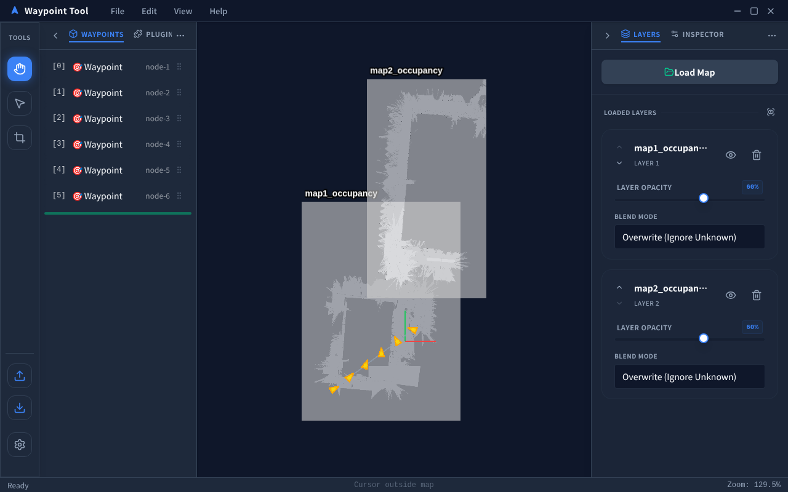
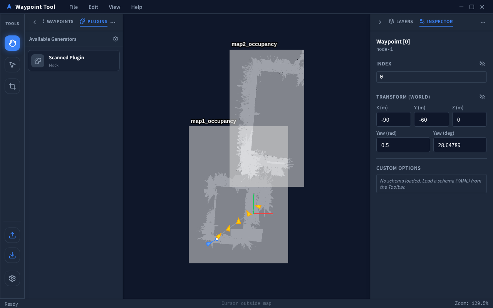
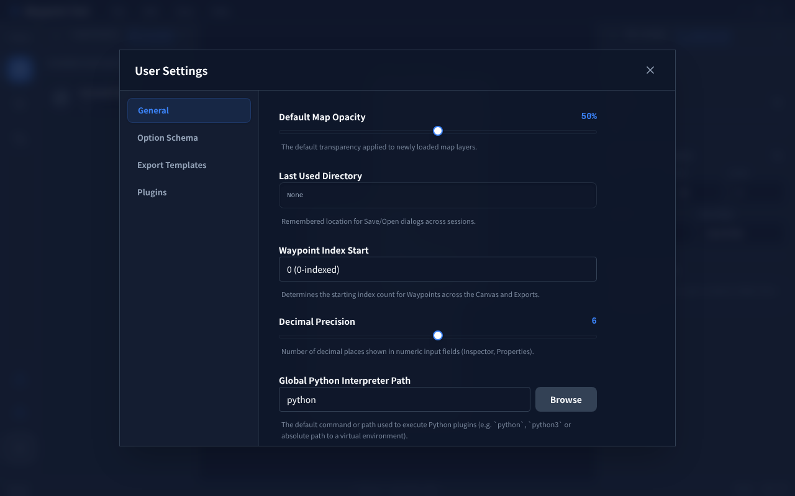
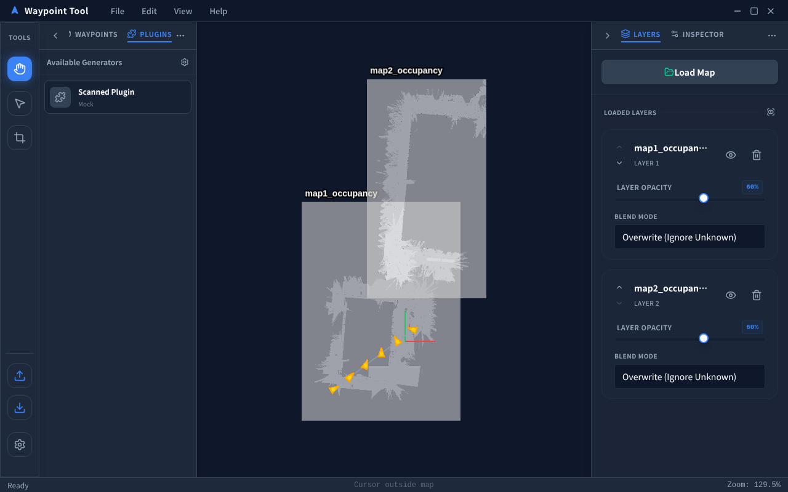

# ユーザーガイド (User Guide)

本ドキュメントは、ROS Waypoint Tool の基本操作から高度なスナップ、カスタム属性の定義、自動生成プラグインの活用までの全機能を解説するガイドです。

---

## 1. 画面構成

  

起動時の画面は以下の領域で構成されています。

| 領域 | 内容 |
|---|---|
| **トップメニューバー** | File / Edit / View / Help メニュー（OS ネイティブタイトルバーと統合） |
| **ツールバー（左端）** | Select / Add Waypoint / Add Export Region ツール、Import / Export / Settings ボタン |
| **左パネル** | 「Waypoints」タブ（ノード階層ツリー）/ 「Plugins」タブ（ジェネレーター一覧） |
| **メインキャンバス** | PixiJS によるマップ・Waypoint の描画・操作エリア |
| **右パネル** | 「Layers」タブ（マップレイヤー管理）/ 「Inspector」タブ（プロパティ編集） |
| **ステータスバー** | カーソル座標（X, Y）・ズーム倍率・アクティブツールの表示 |

---

## 2. マップの読み込みとレイヤー管理

  

### マップの追加
1. 右パネルの **「Layers」** タブを開きます。
2. **「Add Map」** ボタンを押し、ROS 形式の `map.yaml` を選択します（同ディレクトリに `.pgm` または `.png` が必要）。
3. 読み込んだマップがキャンバスに表示されます。

### レイヤー操作
- **表示 / 非表示**: 目のアイコンでトグルします。
- **不透明度**: スライダーで 0〜100% の不透明度を調整できます。
- **読み込み順**: レイヤーをドラッグ＆ドロップして重ね合わせ順を変更できます。
- **削除**: ゴミ箱アイコンでマップを削除します。

### マップフィット
- `View > Fit to Map` メニュー、またはマウスホイール中ボタンのダブルクリックでキャンバスをマップ全体に自動ズーム・フィットさせます。

---

## 3. Waypoint の配置と高度な編集

  

### 基本配置
1. ツールバーの **「Add Waypoint」** ツール（または `P` キー）を選択します。
2. キャンバス上をクリックして Waypoint を配置します。
3. 矢印の先端にある **回転ハンドル** をドラッグすると Yaw 角（姿勢）を変更できます。

### 高度なスナップと連続追加

Add Waypoint ツール選択中、既存のポイントに近づくとスナップ機能が有効になります。

| 操作 | 効果 |
|---|---|
| 近くのポイントへマウスを移動 | 直交方向（X軸 / Y軸）へ自動スナップ |
| 数値を入力（例: `1.5`）+ `Enter` | 基準ポイントから指定距離（メートル）の位置に正確に追加 |
| 数値入力後に `↑↓←→` キー | 基準ポイントの向きを基準に方向を強制ロックして追加 |
| `Tab` / `Shift+Tab` | スナップの基準となるポイント（ロック対象）を順番に切り替え |

### Waypoint の階層管理

  

- 左パネル **「Waypoints」** タブに全ポイントがツリー表示されます。
- **ドラッグ＆ドロップ**で順序を自由に並び替えられます。
- **挿入位置インジケーター（挿入バー）** により、新規追加先を視覚的に確認できます。
- `Shift+クリック` で複数選択し、`Delete` / `Backspace` で一括削除が可能です。

---

## 4. インスペクターによる数値編集

  

Waypoint を選択すると、右パネル **「Inspector」** タブに詳細属性が表示されます。

### Transform
- **X / Y / Z**: ワールド座標（メートル）の数値直接入力
- **Yaw**: 角度（rad）の直接入力（クォータニオンと自動相互変換）
- **Qx / Qy / Qz / Qw**: 姿勢クォータニオン値（参照表示）

### Options
プロジェクトで定義されたカスタム属性（目標速度、停止時間等）の入力フォームが表示されます（→「6. カスタム属性の定義」参照）。

### アンカー・相対座標・連続コピー
- ノードを右クリックして **「Set as Anchor」** を選択すると、アンカーノードからの相対位置・相対角度が表示されます。
- **コンテキストコピー**: Transform の数値ラベルを右クリックすると、その値を連続的に別ノードへ適用するコピーオーバーレイ（`ElementCopyOverlay`）が起動します。

### キャンバス上の属性表示
`View > Show Properties` を有効にすると、各 Waypoint ノード付近に `x, y, yaw` などの詳細テキストがキャンバス上に直接描画されます。

---

## 5. プロジェクトファイルの保存・読み込み

| 操作 | ショートカット | 説明 |
|---|---|---|
| 新規プロジェクト | `Ctrl+N` | ノード・マップなどをリセットして初期状態から開始 |
| 開く | `Ctrl+O` | `.wptroj` ファイルを読み込む（マップ画像・ノード・スキーマを全内包） |
| 保存 | `Ctrl+S` | 現在の状態を `.wptroj` 形式で保存 |
| Undo / Redo | `Ctrl+Z` / `Ctrl+Y` | ノードの追加・移動・削除操作履歴を戻す・やり直す |

---

## 6. カスタム属性の定義（Option Schema）

  

`File > Settings...` またはツールバー下部の歯車アイコンから設定ダイアログを開きます。

**「Option Schema」** タブでは、Waypoint に割り当てる追加属性のスキーマを定義できます。

| フィールドの型 | 説明・使用例 |
|---|---|
| `string` | 動作モード名、タスク識別子 |
| `float` | 目標速度 (m/s)、許容誤差 |
| `integer` | ウェイポイント通過時停止時間 (sec) |
| `boolean` | 一時停止フラグ、センサスキャン無効化 |
| `list` | 選択肢リスト（ドロップダウンフォーム生成） |

1. 「Add Field」でフィールド名・型・デフォルト値を追加します。
2. 「Apply Schema」を押すと、Inspector の「Options」セクションに動的入力フォームが即座に生成・反映されます。

---

## 7. エクスポート・インポート機能

### Waypoint エクスポート
`File > Export Waypoints...`（または `Ctrl+E`、ツールバーの Download アイコン）から実行します。

**「Export Templates」** タブ（Settings 内）で Handlebars テンプレートを定義することで、ROS の standard `waypoints.yaml` だけでなく、独自の `.json` や `.csv` 形式等として出力可能です。テンプレートごとに出力ファイルのサフィックス（例: `_goal.yaml`）を自由に設定できます。

### Waypoint インポート
`File > Import Waypoints...`（ツールバーの Upload アイコン）から実行します。

### マップ画像エクスポート
ツールバーの **「Add Export Region」** ツールでキャンバス上の領域を指定し、`File > Export Maps...` から切り出しマップ画像を保存できます。

---

## 8. プラグイン・自動生成（Generators）

  

左パネルの **「Plugins」** タブに、利用可能な Waypoint 自動生成プラグイン一覧が表示されます。

### 使い方
1. プラグイン一覧からアルゴリズムを選択してクリックします。
2. **インタラクション入力**: プラグインが指定する入力モード（単一座標・矩形範囲・既存 Waypoint 参照等）に従い、キャンバス上で操作します。
   - 操作中はキャンバス上部に浮遊ガイドバナー（`FloatingActionBanner`）が表示されます。
3. **パラメータ調整**: 右パネル「Inspector」にプラグイン固有のパラメータが表示されます。値を変更するとキャンバス上でリアルタイムにプレビューが更新されます。
4. **確定**: 「Apply」ボタンでプレビュー結果を正式な Waypoint ノードとしてプロジェクトに追加します。

### ジェネレーターの展開（Explode）
生成されたジェネレーターオブジェクトを「バラして」個別の独立した手動 Waypoint ノードに変換する機能です。**一度展開するとジェネレーター状態には戻せません。** Inspector の「Explode」ボタンから実行します。

### プラグインの設定
`Settings > Plugins` タブからプラグインの探索パスや有効/無効を管理できます。各プラグインに対してカスタムアイコン（PNG / JPG / SVG）をアップロードして識別性を向上させることも可能です。

---

## 9. ビュー操作・キーボードショートカット

### キャンバス基本操作

| 操作 | 説明 |
|---|---|
| 左ドラッグ（Select ツール） | キャンバスをパン移動 |
| スクロールホイール | ズームイン / アウト |
| 中ボタンダブルクリック | マップを画面全体にフィット |
| 左クリック（Select ツール） | Waypoint ノードを選択 |
| `Shift` + 左クリック | 複数ノードの選択 |
| 右クリック（ノード上） | アンカー設定 / コンテキストメニュー表示 |

### グローバルキーボードショートカット一覧

| アクション | キー |
|---|---|
| New Project | `Ctrl` + `N` |
| Open Project | `Ctrl` + `O` |
| Save Project | `Ctrl` + `S` |
| Export Waypoints | `Ctrl` + `E` |
| Select All Nodes | `Ctrl` + `A` |
| Undo | `Ctrl` + `Z` |
| Redo | `Ctrl` + `Y` |
| Delete Selected | `Delete` / `Backspace` |
| Deselect / Cancel | `Esc` |
| Select Tool | `V` |
| Add Waypoint Tool | `P` |
| Snap 基準点切替（Add モード） | `Tab` / `Shift` + `Tab` |
| 距離入力（Add モード） | 数値キー + `Enter` |
| 軸方向ロック（Add モード） | `↑` `↓` `←` `→` |
| 全ショートカット一覧ヘルプ | `Help > Keyboard Shortcuts` |

---

## トラブルシューティング

| 症状 | 対処方法 |
|---|---|
| **マップ画像が表示されない** | ROS YAML ファイルと同じディレクトリに画像ファイル (`.pgm` または `.png`) が存在するか確認してください。 |
| **Python プラグインが動作しない** | `Settings > General` タブから、動作環境に適した Python 実行パスが正しく指定されているか確認してください。 |
| **ウィンドウレイアウトが崩れた** | `View > Reset Window Layout` をクリックして、左右パネル幅や開閉状態をデフォルトに初期化してください。 |
