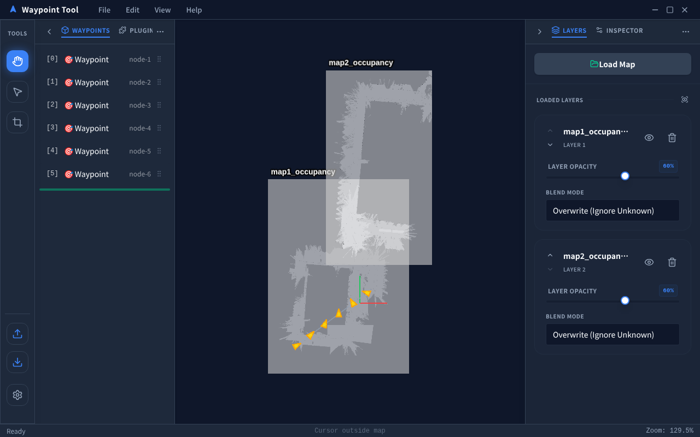
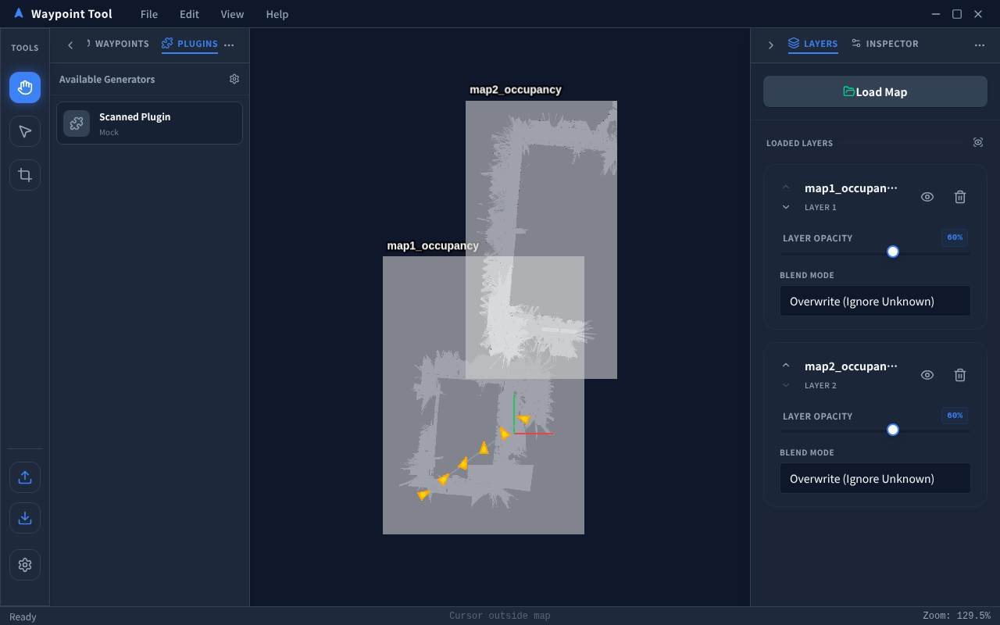

# ROS Waypoint Tool ユーザーガイド (User Guide)

本ドキュメントは、ROS Waypoint Tool の基本操作から、高度なスナップ機能、アノテーション描画、カスタムレイヤー編集、条件付き書式、自動生成プラグイン、パイプライン連携、エクスポートプロファイル、および Custom UI（ワークフローモード）までの全機能を解説する公式ガイドです。

---

## 目次

1. [画面構成とワークスペース](#1-画面構成とワークスペース)
2. [プロジェクトの作成・保存・保護](#2-プロジェクトの作成保存保護)
3. [マップの読み込みとレイヤー管理](#3-マップの読み込みとレイヤー管理)
4. [Waypoint の配置・高度な編集・階層管理](#4-waypoint-の配置高度な編集階層管理)
5. [アノテーションの作成と活用 (Vector ROI)](#5-アノテーションの作成と活用-vector-roi)
6. [カスタムレイヤーの作成・編集 (Raster Occupancy)](#6-カスタムレイヤーの作成編集-raster-occupancy)
7. [ロボットフットプリント & パスルーティング](#7-ロボットフットプリント--パスルーティング)
8. [実寸距離の計測 (Measurement Tool)](#8-実寸距離の計測-measurement-tool)
9. [条件付き書式 (Conditional Styles)](#9-条件付き書式-conditional-styles)
10. [カスタム属性の定義 (Option Schema)](#10-カスタム属性の定義-option-schema)
11. [自動生成プラグイン & パイプライン (Generators & Pipelines)](#11-自動生成プラグイン--パイプライン-generators--pipelines)
12. [インポート・エクスポート & プロファイル](#12-インポートエクスポート--プロファイル)
13. [Custom UI モード (ホワイトラベル & ワークフロー)](#13-custom-ui-モード-ホワイトラベル--ワークフロー)
14. [ショートカット & ビュー操作リファレンス](#14-ショートカット--ビュー操作リファレンス)
15. [トラブルシューティング & FAQ](#15-トラブルシューティング--faq)

---

## 1. 画面構成とワークスペース

<p align="center">
  
</p>

アプリケーションは、高密度かつ洗練されたダークテーマ（Linear Style）で構成されており、以下の主要領域で構成されています：

| 領域 | 名称 | 役割・機能 |
|---|---|---|
| **最上部** | **カスタムタイトルバー** | アプリケーションメニュー（File / Edit / View / Help）、プロジェクト名、未保存インジケータ（`isDirty`）、パス計算ルーターメニュー、ウィンドウ操作コントロール。 |
| **左端** | **メインツールバー (ToolPanel)** | 主要ツールの切り替え（Select, Add Waypoint, Add Export Region, Measure）、および Import / Export / Settings モーダル起動ボタン。 |
| **左パネル** | **サイドパネル (Left)** | 「Waypoints」（ノード階層ツリー）、「Annotations」（ベクター図形ツリー）、「Plugins」（ジェネレーター一覧）等のタブをホスト。 |
| **中央** | **メインキャンバス (MapCanvas)** | PixiJS (WebGL) による高速レンダリング領域。背景マップ、ウェイポイント、パス、フットプリント、アノテーション等の描画と直接対話。 |
| **右パネル** | **サイドパネル (Right)** | 「Layers」（マップ＆カスタムレイヤー管理）、「Inspector」（選択要素の属性・座標・オプション編集）等のタブをホスト。 |
| **最下部** | **ステータスバー (StatusBar)** | 現在のモードバッジ、Escキー遷移先ボタン、カーソル世界座標 $(X, Y)$・極座標・ローカル座標、挿入位置、選択ノード数、全経路長、未保存バッジ＆クイック保存、マップ解像度、ズーム倍率、Fitボタン。 |

### パネルの自由ドッキングと上下分割
- **タブ切り替え / 上下分割**: 左右各パネル右上のアイコンをクリックすることで、タブ形式表示と上下分割表示を切り替えられます。
- **左右ドッキング移動**: タブヘッダーを右クリックして「Move to Opposite Panel」を選択すると、タブを反対側のパネルへ瞬時に移動できます。
- **タブの並び替え**: タブをドラッグ＆ドロップして好みの順序に並び替えられます。
- **レイアウトのリセット**: `View > Reset Window Layout` を選択すると、パネル幅や配置が初期状態へリセットされます。

---

## 2. プロジェクトの作成・保存・保護

### プロジェクトファイル (`.wptroj`)
本ツールは、作業状態のすべて（マップ画像のBase64データ、全Waypoint階層、アノテーション、カスタムレイヤー、ロボットフットプリント、カスタム属性スキーマ、エクスポートテンプレート、UI設定等）を単一のプロジェクトファイル（`.wptroj`）に完全内包して保存します。

| アクション | ショートカット | 説明 |
|---|---|---|
| **New Project** | `Ctrl + N` | 現在の作業をリセットし、初期状態から新しいプロジェクトを開始します。 |
| **Open Project...** | `Ctrl + O` | 保存済みの `.wptroj` ファイルを選択して読み込みます。 |
| **Save Project** | `Ctrl + S` | 現在のプロジェクトを上書き保存（未保存時はファイル選択ダイアログが開きます）。 |
| **Undo / Redo** | `Ctrl + Z` / `Ctrl + Y` | ノードの追加・移動・変形・削除などの操作履歴を元に戻す・やり直す。 |

### 未保存変更の全経路保護 (Data Protection Guard)
ユーザーの作業データを保護するため、未保存の変更（ステータスバーやタイトルバーに `Dirty` 表示）がある状態で「新規作成」「開く」「ウェルカム画面への移動」「ドラッグ＆ドロップでの別ファイル読み込み」を実行しようとすると、必ず確認ダイアログが表示され、不意のデータ消失を防止します。

---

## 3. マップの読み込みとレイヤー管理

<p align="center">
  
</p>

### マップの追加
1. 右パネルの **「Layers」** タブを開きます。
2. **「Add Map」** ボタン（またはキャンバス中央のドラッグ＆ドロップエリア）から、ROS 形式の `map.yaml` を選択します（同ディレクトリに対応する `.pgm` や `.png` 画像が必要です）。
3. 読み込まれたマップがキャンバスに描画されます。

### レイヤーの操作
- **表示 / 非表示**: レイヤーカードの目のアイコンをクリックしてトグルします。
- **不透明度調整**: スライダー（0〜100%）で透過度を滑らかに変更できます。
- **重ね合わせ順序**: レイヤーカードの上下ボタンで順序を変更できます。マップとカスタムレイヤーは 1 本のスタックにまとまっており、「マップ A の上・マップ B の下」にカスタムレイヤーを挟むこともできます（上にあるレイヤーが後から合成されます）。
- **アクティブマップ設定**: 複数マップ存在時、基準とするアクティブマップを選択できます。

### マップの一部だけを使う（複製と「Use Area」）
「map1 の右半分と map2 の左半分だけを使う」といった合成ができます。
1. マップのレイヤーカードで **複製（コピーアイコン）** を押すと、同じマップを指すレイヤーが直上に追加されます（画像は複製されず、位置合わせ・占有閾値は同じマップの全レイヤーで共有されます。カードに `Shared ×N` と表示されます）。
2. 設定（スライダーアイコン）を開き、**Use Area** をオンにします。次のいずれかで領域を決めます（座標はワールド座標 m）。
   - **Draw on canvas**: キャンバス上をドラッグして矩形を描きます（既存の領域は置き換わります。Shift+ドラッグで領域を追加）。領域の 8 つのハンドルをドラッグして大きさを変えられます。描画中は対象のマップを切り抜かずに全体を表示します。**Done drawing**、`V` キー、Esc で終了します。ドラッグ全体が Undo 1 回で、ドラッグ中の Esc で取り消せます。
   - `Left half` / `Right half` / `Top half` / `Bottom half` で半分を選ぶ。
   - `X / Y / W / H` で矩形を直接指定する。
3. **Add area**（または Shift+ドラッグ）で矩形を足すと、和集合の形（L 字など）を作れます。複数の矩形を 1 レイヤーにまとめる代わりに、複製したレイヤーごとに別の領域を割り当てても構いません。
4. 領域外は合成に参加せず、通常表示・Merged プレビュー・統合エクスポート・プラグインへ渡す占有格子のすべてに反映されます。Use Area をオフにするとマップ全体に戻ります。

### 3色占有ハイライト表示 (Occupancy Highlight Filter)
`Settings > Appearance` で「Occupancy Highlight」を有効にすると、PixiJS GPU GLSL シェーダーによりマップ画像がリアルタイムに3色色分け表示されます：
- **赤色 (Obstacle)**: 障害物領域（占有閾値以上）
- **緑色 (Free)**: 移動可能領域（自由空間閾値以下）
- **紫色 (Unknown)**: 未知領域

### マップフィット
- `View > Fit to Map`、ステータスバー右端の **Fit** ボタン、またはマウス中ボタンのダブルクリックにより、キャンバス上の全マップが画面にぴったり収まるよう自動ズーム・センタリングされます。

### 背景地図（OpenStreetMap / 衛星画像）との重ね合わせ (Geo Base Map)
Layers タブ最上部の **Geo Base Map** カードで、実際の地図をすべてのレイヤーの最背面に表示できます（インターネット接続が必要。一度表示したタイルはキャッシュされ、オフラインでも表示されます）。

1. スイッチをオンにします。
2. **Base map** で種類を選びます：`Map (OpenStreetMap)`（道路地図）、`Satellite (Esri)`（衛星画像）、`Aerial Photo (GSI Japan)`（国土地理院の空中写真）、`Standard Map (GSI Japan)`、`Custom URL`（`{z}` `{x}` `{y}` を含むタイル URL）。切り替えても位置合わせはそのまま保たれます。
3. **World origin (0, 0) is at** に、ワールド座標の原点（ROS マップの座標 (0, 0)）が実世界のどこに当たるかを、緯度経度または UTM で入力します。
4. 重なりを見ながら **Alignment** で調整します。
   - **Offset X / Y (m)**、**Rotation (°)**（反時計回りが正）を数値入力します。
   - **Align on canvas** を押すと位置合わせモードになり、キャンバス上を**ドラッグして地図を移動**、**Shift+ドラッグで原点まわりに回転**できます（原点の位置にマーカーが表示されます）。ドラッグ中に `Esc` で開始前に戻り、もう一度 `Esc`（または **Done aligning**）で選択モードへ戻ります。中ボタンドラッグでのパンは通常どおり使えます。
   - 1 回のドラッグ、または 1 つの入力欄への入力は `Ctrl+Z` で 1 回で元に戻せます。**Reset** でオフセットと回転を 0 に戻します。
5. **Opacity** で背景地図の濃さを調整します。設定はプロジェクトファイルに保存されます。

> 地図データの提供元の利用条件に従ってください（OpenStreetMap のタイルサーバーは大量取得や商用の常時利用に制限があります）。画面右下に表示される帰属表示は消せません。

---

## 4. Waypoint の配置・高度な編集・階層管理

<p align="center">
  
</p>

### 基本配置
1. ツールバーの **「Add Waypoint」** ツール（または `P` キー）を選択します。
2. キャンバス上の任意の位置をクリックすると、新しい Waypoint が追加されます。
3. ノード先端の **Yaw 回転ハンドル** をドラッグすることで、ロボットの向き（姿勢角）を直感的に設定できます。

### 高度な直交スナップと精密数値入力
既存の Waypoint 付近で作業する際、強力なスナップ機能が自動的に作動します：

| 操作 | 動作と効果 |
|---|---|
| **マウスを既存ノードに近づける** | X軸 / Y軸 直交方向へのスナップガイド線が自動表示されます。 |
| **数値入力（例: `1.5`）+ `Enter`** | 基準ノードから指定した距離（メートル）の位置に正確にポイントを追加します。 |
| **矢印キー（`↑`, `↓`, `←`, `→`）** | 基準ノードから前後左右（0°, 90°, 180°, 270°）への軸方向を強制ロックします。 |
| **`Tab` / `Shift + Tab`** | スナップの基準となるノードを順番に切り替えます。 |

### 階層ツリー管理 (`WaypointTree`)
<p align="center">
  
</p>

- **階層構造**: ノードはグループ（`group` / `manual_group`）で論理的にフォルダ分けできます。
- **ドラッグ＆ドロップ並び替え**: ツリー内でノードを自由に並び替えられます。`Shift + クリック` で不連続な複数ノードを選択し、一括でドラッグ移動（連続化配置）することも可能です。
- **挿入位置インジケーター（青いライン）**: 次に新規作成されるノードが追加される位置を視覚表示します。ツリー行をクリックすることで任意の場所に挿入先を指定できます。

### インスペクターによる数値編集
右パネル **「Inspector」** タブで、選択中ノードの詳細値を編集できます：
- **Transform**: ワールド座標（$X, Y, Z$）および姿勢（Yaw角 / クォータニオン $qx, qy, qz, qw$）。
- **アンカー設定**: ノードを右クリックして「Set as Anchor」を選択すると、基準アンカーノードからの相対座標（$dx, dy, dz, dYaw$）が表示・編集できます。
- **Transform の連続コピー (`element_paste`)**:
  インスペクターの Transform ラベル（X, Y, Z, Yaw）を右クリックしてコピー状態にし、キャンバス上の別ノードをクリックしていくことで、同じ数値を連続的に素早く適用できます。

---

## 5. アノテーションの作成と活用 (Vector ROI)

アノテーションは、進入禁止エリア（Keep-out Zone）、走行推奨レーン、仮想壁、目標エリアなどの**ベクター幾何メタデータ**を管理する機能です。

### 5つの幾何図形
1. **Point**: 単一の目標地点やランドマーク。
2. **OrientedPoint**: 向き情報（Yaw）を持った指定地点。
3. **Line**: 境界線、仮想壁、進入禁止ライン（実寸長さ表示可能）。
4. **Rect**: 矩形の関心領域（ROI）や進入禁止エリア（回転可能）。
5. **Circle**: 円形の防護エリアやクリアランスゾーン。

### 操作方法
1. 左パネルの **「Annotations」** タブを開き、「Add Annotation」または各サブツールを選択します。
2. キャンバス上をドラッグして図形をラバーバンド描画します。
3. 描画後は、頂点ハンドル、リサイズハンドル、回転ハンドルをドラッグしてサイズや角度を自由に変形できます。
4. 色や透過度、ラベル表示のON/OFFは右パネルの **Annotation Inspector** で調整できます。

---

## 6. カスタムレイヤーの作成・編集 (Raster Occupancy)

カスタムレイヤーは、Occupancy Grid（占有格子地図）のピクセルレベルでの加筆・修正を行う機能です。

### 手動ベクター描画レイヤー (`manual`)
- 直線（`Line`）、矩形（`Rect`）、円形（`Circle`）、フリーハンドブラシ（`Freehand`）を使って、マップ上に障害物（黒 / 値0）や走行可能エリア（白 / 値255）を描画できます。
- 描画した図形はベクターオブジェクトとして保持されるため、後から何度でもリサイズや移動、回転が可能です。

### プラグイン生成レイヤー (`plugin`)
- 外部プラグイン（走行可能エリア抽出やノイズ除去等）が出力した占有格子画像をレイヤーとして追加できます。

### ブレンドモードとリアルタイムプレビュー
- **Overwrite**: 上のレイヤーの値で下層を完全に塗りつぶします。
- **Merge Obstacles**: 障害物（黒ピクセル）を優先して合成します。
- **Merge Free**: 自由空間（白ピクセル）を優先して合成します。
- Rust バックエンドによる高速プレビュー（`blend_map_preview`）により、複数レイヤーの重ね合わせ結果を即座に確認できます。

---

## 7. ロボットフットプリント & パスルーティング

### ロボットフットプリント設定
`Settings > Robot Footprint` でロボットの外形寸法を定義します：
- **円形 (Circular)**: 半径 (m)
- **矩形 (Rectangular)**: 前後長 (Length)、左右幅 (Width)、中心オフセット
- **多角形 (Polygon)**: 頂点座標リスト $[[x, y], ...]$（ROS Nav2 標準形式テキストと相互同期）

キャンバス上でフットプリント表示を有効にすると、各 Waypoint の位置と向きに合わせてロボットの実寸フットプリント枠と進行方向インジケーターが描画されます。

### パスルーティングとコリドー帯
- **パス計算**: トップバーの **Path Router Menu** から、直線補間または組み込みの **Dijkstra 回避パス計算プラグイン** を選択できます。
- **Auto Recalculate**: 有効にすると、ノードを追加・移動するたびに障害物を自動回避する安全な経路がリアルタイムに再計算されます。
- **コリドー帯描画**: パスラインをロボットのフットプリント幅と同期させた実寸幅の半透明通過帯（コリドー）として描画し、通路の狭小箇所でロボットが壁に接触しないか視覚的に検証できます。

---

## 8. 実寸距離の計測 (Measurement Tool)

1. ツールバーの **「Measure」** アイコン（または `M` キー）を押します。
2. キャンバス上の任意の2点、またはノード/アノテーションの頂点をクリックします。
3. 2点間の直線距離 (m) および X軸・Y軸成分 ($dx, dy$) が HUD バッジとしてリアルタイム表示されます。
4. バナーの「Save as Annotation」をクリックすると、計測結果を寸法線アノテーション（`LineAnnotation`）として保存できます。

---

## 9. 条件付き書式 (Conditional Styles)

Waypoint やパス、フットプリント、アノテーションの属性値（例: 目標速度、タスク名、停止時間）に応じて、キャンバス上の表示スタイルを自動的に切り替える機能です。

### 設定手順
1. `Settings > Conditional Styles` タブを開きます。
2. **「Add Rule」** をクリックし、対象要素（Waypoint / Path / Footprint / Annotation）を選択します。
3. 条件（AND / OR グループ）を設定します（例: `options.speed >= 1.5`、`name contains "charge"`）。
4. オーバーライドするスタイルを設定します：
   - **Waypoint**: 色、塗りつぶし色、マーカー形状（Circle, Square, Diamond, Star等）、スケール
   - **Path**: 線色、実寸線幅、破線パターン（Dashed, Dotted）
   - **Footprint**: 強制表示、カスタムサイズ
5. ルールは上から順に評価され、ドラッグ＆ドロップで優先順位を変更できます。

---

## 10. カスタム属性の定義 (Option Schema)

Waypoint にロボット独自のカスタム属性を付加できます。

1. `Settings > Option Schema` タブを開きます。
2. **「Add Field」** をクリックし、フィールド名、表示ラベル、型を設定します。
3. 「Apply」を押すと、全 Waypoint の Inspector 内の「Custom Options」セクションに専用の入力フォームが動的に生成されます。

### サポートする型

| 型        | 説明                                                   | Inspector での編集                       |
| --------- | ------------------------------------------------------ | ----------------------------------------- |
| `string`  | 文字列。**Choices** を設定するとプルダウンになる。      | テキスト入力 / プルダウン                 |
| `float` / `integer` | 数値。                                        | 数値入力                                  |
| `boolean` | 真偽値。                                                | トグルスイッチ                            |
| `list`    | 配列。要素の型を選べる。                                | 要素がスカラーなら1件ずつの入力欄（カンマ区切りテキストからの一括貼り付けも可）、`object`/`union` 等の構造体なら追加・削除・並べ替えできるカード一覧 |
| `object`  | 固定フィールドを持つ入れ子オブジェクト。                | フィールドごとの入力欄                    |
| `map`     | 自由なキーと、共通の値の型を持つ辞書。                  | キーの追加・リネーム・削除 + 値の入力  |
| `union`   | 判別キー (`Discriminator Key`) の値ごとにフィールド構成が変わるタグ付きバリアント。 | バリアント選択 + 選択中バリアントのフィールド入力（バリアントを切り替えると、同名のフィールドは値を引き継ぎ、新しいバリアントに無いフィールドは破棄される） |
| `any`     | 構造を規定しない自由な JSON 値。                        | JSON テキスト入力                         |
| `Ref`     | `Definitions`（後述）で定義した型を参照する。           | 参照先の型と同じ編集 UI                   |

`list`/`object`/`map`/`union` は GUI 上で自由な深さに入れ子にできます（例: `object` のフィールドがさらに `list<union>` を持つ、といった構成も組み立てられます）。

各フィールドには、任意で **Required**（値も既定値も未設定だと Inspector で警告し、エクスポート前に件数を示して確認する）と **Description**（Inspector にツールチップとして表示される補足説明）を設定できます。また、`Ref` 以外のどの型にも **Presets**（名前付きの値の候補）を定義できます。詳しくは後述の「プリセット」を参照してください。

**例: 到達時に実行するアクションの一覧**（`type` によって必要なフィールドが変わる）

同じ構造を複数のフィールドから使い回したい場合は、`Settings > Option Schema` の **Definitions** セクションで名前付きの型を定義し、フィールドの型を `Ref` にしてその名前を選びます。例えば「到達時アクション」を `action` という名前で1つ定義しておけば、`on_reached_actions` と `on_departure_actions` の両方から同じ `action` 型を参照できます。

```yaml
options:
  - name: on_reached_actions
    label: "到達時アクション"
    type: list
    item: { type: ref, ref: action }
definitions:
  - name: action
    type: union
    discriminator: type
    variants:
      - value: wait
        label: "待機"
        fields:
          - { name: countdown_ms, label: "待機時間(ms)", type: integer, default: 3000 }
      - value: service
        label: "サービス呼び出し"
        fields:
          - { name: service, label: "サービス名", type: string, required: true }
          - { name: request, label: "リクエスト", type: map }
      - value: amcl_reset
        label: "AMCLリセット"
        fields: []
```

この YAML を `Settings > Option Schema` の **Import** から読み込むと、`on_reached_actions` オプションが定義され、各 Waypoint の Inspector でアクションを1件ずつ追加し、種類（`wait` / `service` / `amcl_reset`）を選んでフィールドを入力できるようになります。`service` フィールドは `required: true` なので、未入力のままだと Inspector に必須マーク（`*`）が表示されます。

### プリセット（名前付きの値の候補）

「tolerance は実際には小/大の2種類しか使わない」「同じサービスを呼ぶアクションを何度も同じ内容で入力するのは大変」といった場合は、フィールドの型に **Presets** を定義しておくと、Inspector からは値を直接入力する代わりに名前で選べるようになります。プリセットの値を後から変更すると、それを参照している全ての Waypoint に一括で反映されます。

1. `Settings > Option Schema` で、フィールド（Option / Global / `object` のフィールド / `union` のバリアントフィールド / Definitions）の型編集欄にある **「Presets」** で **「Add Preset」** をクリックし、名前・表示ラベル・値（既定値と同じ、型付きの入力欄）を設定します。
2. 「プリセットからのみ選択可能にする」にチェックすると、そのフィールドは自由な値を入力できなくなり、プリセットからの選択に限定されます（チェックしない場合は、プリセットを選ぶこともカスタム値を入力することもできます）。
3. Apply 後、Inspector の対象フィールドにプリセットのプルダウンが現れます。プリセットを選ぶと、値はそのプリセットへの参照になり、下の入力欄は参照先の値を読み取り専用で表示します。「カスタム値」を選ぶと、参照していた値をコピーして編集を続けられます。

`union` 型そのものにプリセットを付けると、「定型のアクション一式」を丸ごと再利用できます。`definitions` に定義した型のプリセットは、その型を `ref` で参照している全箇所で共有されます。

```yaml
options:
  - name: through_tolerance
    label: "通過判定半径 [m]"
    type: float
    default: 3.0
    presets:
      - { name: small, label: "小 (1.5m)", value: 1.5 }
      - { name: large, label: "大 (3.0m)", value: 3.0 }
definitions:
  - name: action
    type: union
    discriminator: type
    presets:
      - name: front_lidar_on
        label: "前方LiDAR 有効化"
        value: { type: service, service: /front_lidar/enable, srv_module: std_srvs.srv, srv_class: SetBool, request: { data: true } }
    variants:
      - value: service
        fields:
          - { name: service, label: "サービス名", type: string, required: true }
          - { name: srv_module, label: "モジュール", type: string, required: true }
          - { name: srv_class, label: "クラス名", type: string, required: true }
          - { name: request, label: "リクエスト", type: map }
```

**既存の値をプリセットへまとめて置き換える**: すでに入力済みの値（インポートした値を含む）が、あるプリセットと完全に一致していても、自動では参照に変わりません。`Settings > Option Schema` の該当プリセットに「使用中: N件」「一致する未参照の値: M件」という表示が出るので（Apply 済みで未適用の編集が無いときだけ表示されます）、「一致する値を参照に置換」をクリックすると、一致する全ての値を一括で参照に置き換えます（Undo 可能）。

**プリセットの名前変更・削除**: プリセットの名前を変えると、既存の参照は「未定義のプリセット」として警告されます（Inspector から選び直せます）。プリセット自体を削除して Apply すると、それを参照していた値は自動的に削除前の実際の値へ展開され（エクスポート結果が変わらないように）、件数を示して確認されます。

### 未設定の値とスキーマ既定値の違い

フィールドに何も入力しなければ、その値は「未設定」としてプロジェクトファイルに保存されません（`default` を書いても、それはあくまで Inspector の表示や、エクスポート時の補完に使われるだけです）。この区別は、「フィールドを省略すると受け側のデフォルトが使われる」形式の外部フォーマットへ書き出す際に重要です。

- 値を明示的に入力したフィールドには、Inspector に「既定値に戻す」ボタン（↺）が表示され、クリックすると未設定に戻ります。
- 未設定のフィールドには、既定値がプレースホルダとグレーの「既定」バッジで示されます（実際の値としては保存されません）。
- エクスポートテンプレートからは、次の2種類の値を参照できます。
  - `options.*`: スキーマの既定値を補った実効値（既存のテンプレートと同じ、これまでどおりの参照方法）
  - `raw_options.*`: 明示的に入力された値だけ（未入力のフィールドは含まれない）

### グローバルフィールド（プロジェクト全体の変数）

Waypoint ごとではなく、プロジェクト全体で1つの値を持つ変数を定義できます。エクスポートするファイルに「デフォルト速度」のような全体設定の項目がある場合に使います。ウェイポイント属性と同じ型（`object`/`union` 等も含む）を利用できます。

1. `Settings > Option Schema` タブの **「Global Fields」** で **「Add Global」** をクリックし、フィールド名、表示ラベル、型、**値（Value）** を設定して「Apply」を押します。値はプロジェクト（`.wptroj`）に保存されます。
2. `Settings > Export Templates` のテンプレート編集欄に **Global Fields** のチップが表示されます。クリックすると、選択中のテンプレートエンジンに応じた参照式（Handlebars なら `{{@root.globals.フィールド名}}`、Jinja なら `{{ globals.フィールド名 }}`）が挿入されます。
3. エクスポート時、テンプレート内でグローバルフィールドの値に置き換わります。

- 値が未入力のフィールドは出力に含まれず、テンプレート上では空になります。
- 既定のYAML/JSON出力（テンプレートを使わない形式）にはグローバルフィールドは含まれません。

---

## 11. 自動生成プラグイン & パイプライン (Generators & Pipelines)

<p align="center">
  
</p>

### プラグインの利用手順
1. 左パネルの **「Plugins」** タブを開き、利用したいアルゴリズム（ジグザグ走査、領域探索、障害物回避経路等）をクリックします。
2. **インタラクション入力**: プラグインが要求する入力形式（座標クリック、矩形範囲ドラッグ、既存 Waypoint / アノテーションの選択等）に従ってキャンバス上で指定します。
3. **パラメータ調整**: 右パネルの Inspector に表示されるパラメータを変更すると、キャンバス上にリアルタイムで生成プレビューが更新されます。
4. **確定**: 「Apply」ボタンを押すと、プロジェクトに正式なノードとして登録されます。

### 再生成と手動編集の競合解決 (Diff & Stash)
ジェネレーターで生成した Waypoint を手動で微調整した後、プラグインのパラメータを変更して再生成（Regenerate）しようとすると、競合解決ダイアログ（`GeneratorRegenerateConflictModal`）が表示されます：
- **Keep Modifications (Stash)**: 手動で行った座標やオプションの修正を保持したまま、新しいパラメータで再生成します。
- **Overwrite**: 手動修正を破棄し、プラグインの計算結果で完全に上書きします。
- **Cancel**: 再生成を取り消します。

### ジェネレーターの展開 (Explode)
自動生成グループを「手動グループ」にバラして、個別のノードを完全に独立した手動 Waypoint として自由編集できるようにします（※不可逆操作）。

### パイプラインレシピの実行
複数プラグインを組み合わせた高度な自動処理（例: 1. 走行可能領域抽出 → 2. 領域内探索経路生成 → 3. 障害物回避スムージング）をワンクリックで実行できます。手動で入力すべきパラメータは `PipelineSetupView` に集約されて表示されます。

### Python 仮想環境の自動セットアップ (venv)
`Settings > Plugins` 内の「Setup Python venv」から、プラグイン実行に必要な仮想環境の構築および依存 pip パッケージのインストールをワンクリックで行えます。

---

## 12. インポート・エクスポート & プロファイル

### カスタムテンプレートによる自由出力
`File > Export Waypoints...`（または `Ctrl + E`）から実行します。
`Settings > Export Templates` で定義したテンプレートにより、標準の YAML だけでなく、JSON、CSV、ROS2 Nav2 XML 形式など任意のフォーマットで出力可能です。テンプレートごとに **Engine**（`Jinja` または `Handlebars`）を選べます。

- **Jinja**（新規テンプレートの既定）: MiniJinja による Jinja2 互換のテンプレートエンジン。``/`` による反復・分岐、四則演算・比較・論理演算、`tojson`（コンパクトな JSON 断片）、`toyaml`（ブロック形式の YAML 断片。`toyaml(2)` のように字下げ幅を指定できる）、`round`/`default`/`length` 等の標準フィルタが使えます。未定義の変数を出力・反復・属性アクセスしようとするとエラーになり typo を早期に検出できますが、`is defined` による存在チェックはエラーになりません。
- **Handlebars**: 既存プロジェクトとの後方互換のために残しています。`{{#each waypoints}}...{{/each}}` で反復し、ループの外の値は `{{@root.変数名}}` で参照します。

いずれのエンジンでも、各ウェイポイントについて次の値を参照できます。

| 変数 | 内容 |
| --- | --- |
| `index`, `id`, `type` | 連番インデックス、ノードID、種別 |
| `x`, `y`, `z`, `yaw`, `qx`, `qy`, `qz`, `qw` | 座標・姿勢 |
| `options.*` | カスタム属性（スキーマの既定値を補った実効値） |
| `raw_options.*` | カスタム属性（明示的に入力された値だけ） |

**例: mg_robot 形式の `on_reached_actions` を Jinja + `toyaml` で出力する**

```jinja
version: "2.0"
defaults:
  is_through_point: true
waypoints:

  - index: {{ wp.index }}
    pose:
      position: {x: {{ wp.x }}, y: {{ wp.y }}, z: {{ wp.z }}}
      orientation: {x: {{ wp.qx }}, y: {{ wp.qy }}, z: {{ wp.qz }}, w: {{ wp.qw }}}
    navigation:
      is_through_point: {{ wp.options.is_through_point | tojson }}

    on_reached_actions:
{{ wp.raw_options.on_reached_actions | toyaml(6) }}


```

`raw_options.on_reached_actions` を使っているのは、アクションを設定していないウェイポイントでは `on_reached_actions` フィールド自体を出力しないためです（`options.on_reached_actions` を使うと、スキーマの既定値まで書き出されてしまいます）。実際に動く完全なサンプルは `docs/sample/option_schemas/` にあります。

### テンプレートインポート
`File > Import Waypoints...` から、外部ファイルを読み込めます。テンプレート内容からカラムマッピングが自動推論（`infer_import_mapping`）されるため、CSV 等のデータも手軽に取り込めます。

### 一括エクスポートプロファイル (Export Profiles)
複数のエクスポート処理（例: ゴール地点YAML、通過点JSON、切り出しマップ画像PNG）を1つの「プロファイル」として保存し、ワンクリックで全ファイルを一括生成できます。
- 出力先ファイルの既存ファイル衝突を事前に検知し、「上書き（Overwrite）」または「自動バックアップ（Backup）」を安全に選択できます。
- Option Schema で `required` を設定したフィールドが未入力（既定値も無い）のウェイポイントがある場合、あるいは値の型がスキーマと合わない場合は、件数を示す確認ダイアログが表示されます。エクスポート自体はブロックされないため、意図的に空のまま出力したい場合は「続行」を選べます。

### マップ切り出しエクスポート
ツールバーの **「Add Export Region」** でキャンバス上に領域枠を作成し、`File > Export Maps...` から指定範囲のマップ画像のみを高解像度ラスタライズして保存できます。

---

## 13. Custom UI モード (ホワイトラベル & ワークフロー)

Waypoint Tool は、設定ファイル `custom-ui.config.json` を配置するだけで、現場オペレーター向けの専用ツール（ホワイトラベル製品）へと姿を変えることができます。

### 主なカスタマイズ内容
- **ブランド**: アプリ名、ウィンドウタイトル、ロゴ、About 情報の変更。
- **テーマ**: 企業のコーポレートカラーへのテーマ色変更。
- **ワークフローパネル (`WorkflowPanel`)**:
  ステップバイステップ（1. マップ選択 → 2. ロボットサイズ指定 → 3. ルート作成 → 4. 保存）のガイダンス画面を表示し、不要な複雑なツールを隠蔽。
- **標準モードとの切り替え**:
  Custom UI モード動作中も、TopMenu の `Help > Switch to Standard UI` からいつでもフル機能の標準モードと相互に行き来できます。

---

## 14. ショートカット & ビュー操作リファレンス

### キャンバス基本操作
| 操作 | 動作 |
|---|---|
| **左ドラッグ（余白） / 中ドラッグ** | キャンバスのパン（平行移動） |
| **マウスホイール** | ズームイン / ズームアウト |
| **中ボタンダブルクリック** | マップ全体をビューポートにフィット |
| **左クリック** | 要素の単一選択 |
| **`Shift` + 左クリック** | 要素の追加選択 / 複数選択 |
| **`Shift` + 左ドラッグ（Select時）** | 矩形範囲選択（ラバーバンド内のノードを一括選択） |
| **右クリック（要素上）** | コンテキストメニューの表示 |

### グローバルキーボードショートカット
| 機能 | キー | 説明 |
|---|---|---|
| **New Project** | `Ctrl + N` | 新規プロジェクト（未保存保護ガードあり） |
| **Open Project** | `Ctrl + O` | プロジェクトを開く（未保存保護ガードあり） |
| **Save Project** | `Ctrl + S` | プロジェクトの上書き保存 |
| **Export Waypoints** | `Ctrl + E` | エクスポートモーダルの起動 |
| **Select All** | `Ctrl + A` | 全ノードの一括選択 |
| **Undo** | `Ctrl + Z` | 直前の操作を取り消す |
| **Redo** | `Ctrl + Y` | 取り消した操作をやり直す |
| **Delete Selected** | `Delete` / `Backspace` | 選択中のノード・アノテーション・レイヤーを削除 |
| **Escape (Tier 1〜7)** | `Esc` | モーダル閉塞 → フォーカス解除 → アボート → スナップクリア → 選択解除 → ツール復帰 |
| **Select Tool** | `V` | 選択ツールに切り替え |
| **Add Waypoint Tool** | `P` | Waypoint 追加ツールに切り替え |
| **Measure Tool** | `M` | 実寸計測ツールに切り替え |
| **Snap 基準点切替** | `Tab` / `Shift + Tab` | スナップ対象のノードを巡回切り替え |
| **スナップ距離指定** | `0`〜`9`, `.` + `Enter` | 基準ノードからの実寸距離数値を直接入力 |
| **軸方向ロック** | `↑` `↓` `←` `→` | 前後左右方向への配置拘束 |
| **ショートカットヘルプ** | `Help > Shortcuts` | 全ショートカット一覧モーダルを表示 |

---

## 15. トラブルシューティング & FAQ

### Q. マップ画像が表示されず、キャンバスが真っ暗です。
**A.** ROS の `map.yaml` ファイル内に記載されている画像ファイルへのパス（`image:` フィールド）を確認してください。YAML ファイルと同じディレクトリに画像（`.pgm` や `.png`）が配置されている必要があります。

### Q. Python プラグインを実行するとエラーが発生します。
**A.** 
1. `Settings > General` で指定されている Python の実行パスが正しいか確認してください。
2. `Settings > Plugins` の「Setup Python venv」を開き、必須パッケージ（numpy 等）がインストールされているか確認してください。

### Q. ウィンドウのレイアウトやパネルの配置が崩れてしまいました。
**A.** 上部メニューの `View > Reset Window Layout` をクリックしてください。左右パネル幅やタブ配置がデフォルトの初期状態にリセットされます。

### Q. ジェネレーターで生成したノードの座標を個別に編集できません。
**A.** 自動生成ノード（`generator`）はアルゴリズムによって保護されています。手動で個別に編集したい場合は、ノードを右クリックして「Explode Generator」を選択し、手動グループ（`manual_group`）へ展開してください。
